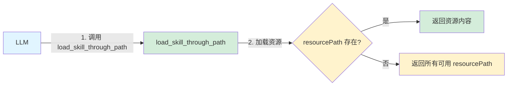
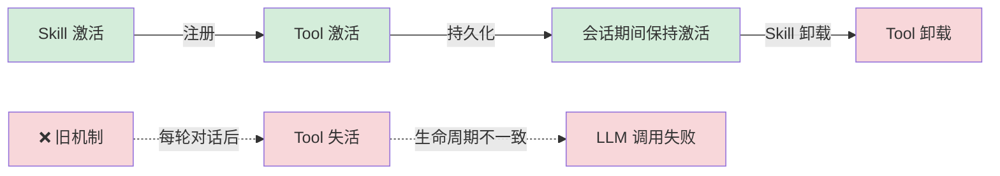
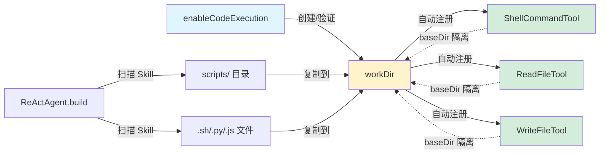
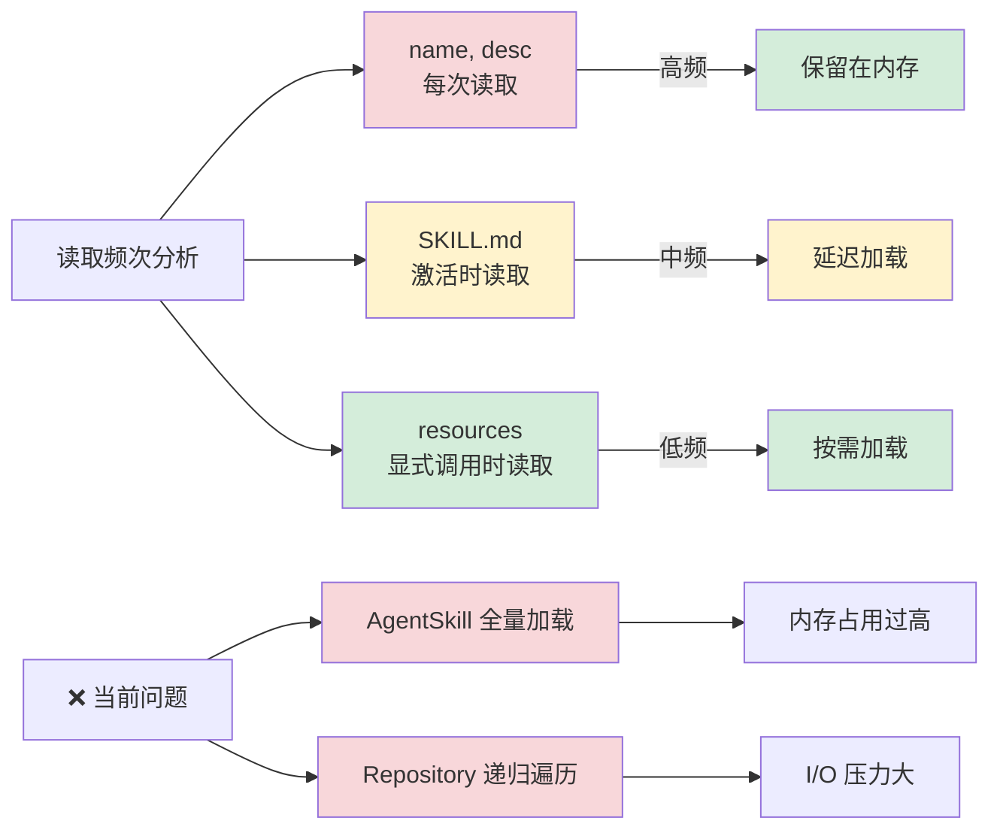
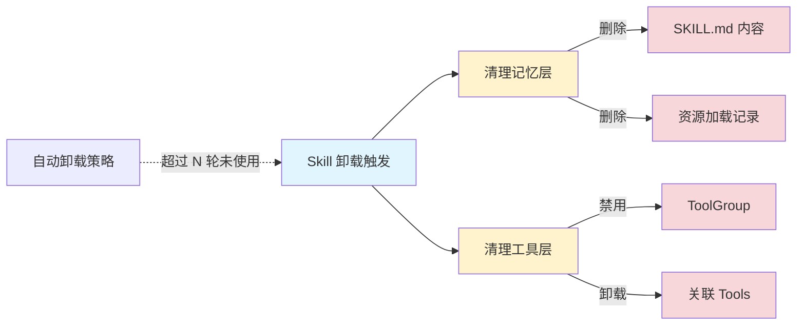
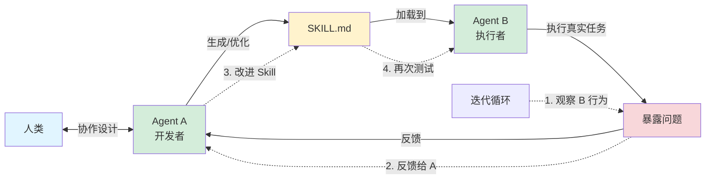

# AgentScope-Java Skill 机制

## 1. CHANGELOG

### 1.1 Skill 加载机制优化



- **统一加载工具**: `load_skill_through_path(skillId, resourcePath)` - 单一入口加载技能资源(Markdown 文档、脚本文件等)
  - skillId使用enum字段, 只允许llm从存在的skillId中选取一个, 确保安全
  - resourcePath是技能资源的路径, 相对于skillId的根目录, 比如skillId为"data_analysis", resourcePath为"references/api-doc.md", 则资源路径为"data_analysis/references/api-doc.md", 如果存在错误会导致llm选择失败, 错误情况会返回所有的可用的resourcePath
- **结构化提示词**: 使用 XML 标签(`<skill>`, `<name>`, `<description>`, `<skill-id>`)组织技能信息,提升 LLM 解析准确性

### 1.2 Tool渐进式披露机制优化



**问题**: 过去会在每轮对话的开始和结束都失活通过Skill注册的Tool
- 这样会导致Skill和通过Skill注册的Tool的生命周期不一致, Skill在被加载以后会一直存在于上下文中, 但是Tool会失活, 这就导致llm会出现想根据记忆中的skill指示去调用某个Tool的时候, 这个tool是失活的

**优化**: 现在不会失活Tool了, Tool会一直存在,与Skill生命周期保持一致

### 1.3 代码执行能力



- **API**: `skillBox.enableCodeExecution(String workDir)`
  - 支持无参调用,自动创建临时工作目录
  - 自动注册三个核心 Tool:
    - `ShellCommandTool`: Shell 命令执行
    - `ReadFileTool`: 文件读取
    - `WriteFileTool`: 文件写入
  - 所有 Tool 以 `workDir` 为 `baseDir`,确保文件夹隔离
- **脚本管理**: 在 `ReActAgent.build()` 时自动将 Skill 的脚本文件(`.sh`/`.py`/`.js` 或 `scripts/` 目录)输出到 `workDir`

## 2. 后续演进计划

### 2.1 更轻量化的加载



- **AgentSkill 内存占用过高**
  - 携带了所有的 Skill 内容，包括 resources，导致内存压力大
  - 按照读频次分析：
    - `(name, desc)` 每次都会读取（用于 Skill 选择）
    - `SKILL.md` 一轮对话中出现次数较少（仅在 Skill 激活时）
    - `resources` 频次最低（仅在显式调用 `load_skill_through_path` 时）

- **Repository 加载 I/O 压力大**
  - 每次 `getSkill()` 都需要递归遍历目录树，读取所有资源文件
  - 对于包含大量资源的 Skill（如文档、示例），初始化成本极高


### 2.2 提供运行时的Skill的从上下文中的卸载功能



**问题**: Skill的运行时上下文管理

**解决方案简述**:
- "从上下文中卸载" 涉及两个层面的清理：
  - 记忆层（Memory）：清除 Skill 相关的对话历史（Skill 的 SKILL.md 内容、资源加载记录）
  - 工具层（Toolkit）：禁用 Skill 关联的 ToolGroup
- 自动卸载超过 N 轮未使用的 Skill?

### 2.3 基于LLM的Skill创建迭代流程



**Skill 迭代开发模式**: 框架支持"双 Agent 协作"的技能开发流程

- **Agent A(开发者)**: 与人类协作设计和优化 Skill 定义
- **Agent B(执行者)**: 加载 Skill 执行真实任务,暴露问题
- **迭代循环**: 观察 B 的行为 → 反馈给 A 改进 → 更新 Skill → 再测试

### 2.4 Tool渐进式暴露中的Tool和Skill之间的映射关系

**问题**

解决 Tool 重复注册和多注册的问题。现在Skill和Tool之间是1:n的关系. 需要解决Skill:Tool=n:1的关系.
作用域隔离：支持 Tool 的 "多开"。同一个 ShellCommandTool 在 Skill A 中可能被限制在 /tmp/a 目录，在 Skill B 中被限制在 /tmp/b。

**解决方案简述**

保持现有 API 不变,框架层自动检测 Tool 重复并合并到共享 ToolGroup

```java
// SkillBox 内部逻辑
public void registerSkill(AgentSkill skill, List<AgentTool> tools) {
    for (AgentTool tool : tools) {
        // 检查是否已存在相同引用的Tool
        String existingGroup = findToolGroupByToolReference(tool);

        if (existingGroup != null) {
            // Tool 已存在,复用现有 ToolGroup
            skillToToolGroupMapping.put(skill.getSkillId(), existingGroup);
        } else {
            // Tool 不存在,创建新 ToolGroup
            String newGroup = skill.getSkillId() + "_skill_tools";
            toolkit.createToolGroup(newGroup, newGroup, false);
            toolkit.registration().group(newGroup).agentTool(tool).apply();
            skillToToolGroupMapping.put(skill.getSkillId(), newGroup);
        }
    }
}
```

### 新的Repo

会在Git仓库/MySQL/Nacos提供新的内置Repo实现