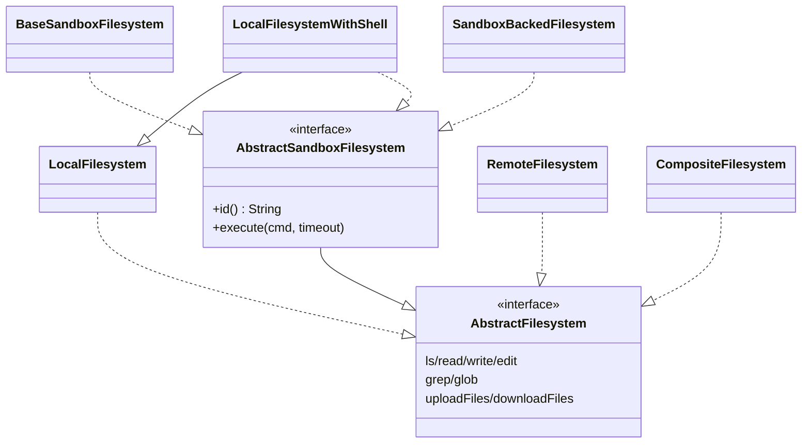

# 文件系统（Filesystem）

## 作用

`AbstractFilesystem` 把 agent 对**工作区**的访问从「一定是本机磁盘」抽象成统一接口：`ls / read / write / edit / grep / glob / upload / download`。需要**在隔离环境执行命令**时，后端再实现 `AbstractSandboxFilesystem`，`HarnessAgent` 才会注册 `ShellExecuteTool`。

在 harness 里，**文件系统承担三种不同但常混为一谈的职责**：

1. **工具面**：`FilesystemTool`（及可选的 `ShellExecuteTool`）只认一个 `AbstractFilesystem` 实例；所有路径与执行都经此出口，便于替换实现。
2. **工作区读写的物理落点**：`WorkspaceManager` 读时「优先走 filesystem、未命中再回退本地」；写与上传一律走 filesystem。因此**长期记忆、日流水账、会话日志**等最终落在哪个介质上，由你选的 **模式** 决定。
3. **多租户与隔离**：`NamespaceFactory` 在每次操作中从 `RuntimeContext.userId` 等来源拼出路径前缀，使同一套代码在**用户 / 会话 / 全局**之间切换存储分片；`RemoteFilesystemSpec` 与 `SandboxFilesystemSpec` 还把 **IsolationScope** 接到「共享 KV」或「沙箱状态键」上，与 [Sandbox](./sandbox.md) 的隔离叙事一致。

## 三种声明式模式

`HarnessAgent.Builder` 在 **`filesystem(...)` 系列** 中**至多选一**（与 **`abstractFilesystem(...)` 互斥**；后者为自带实现的逃生口，见下节）：

| 模式 | 配置方法 | 典型产物 | Shell | 适用场景 |
|------|----------|----------|-------|----------|
| **1 — 复合 + 共享存储** | `filesystem(RemoteFilesystemSpec)` | `CompositeFilesystem`：工作区根上 **无 shell 的** `LocalFilesystem` + 按前缀路由的 `RemoteFilesystem` | 否 | 多副本要共享 `MEMORY.md`、`memory/`、会话落盘等；**不在宿主执行**不受信 shell |
| **2 — 沙箱** | `filesystem(SandboxFilesystemSpec)` | `SandboxBackedFilesystem` + 生命周期由 [Sandbox](./sandbox.md) 描述 | 是（在沙箱内） | 隔离执行、可恢复沙箱会话、可选快照与分布式 Session |
| **3 — 本机 + shell** | `filesystem(LocalFilesystemSpec)` 或**不显式配 filesystem** | `LocalFilesystemWithShell` | 是（宿主 `sh -c`） | 单进程/本机、信任环境、简单脚本与测试 |

**默认未调用任何 `filesystem(...)` 时** 与 **显式 `filesystem(new LocalFilesystemSpec())`** 等价，即模式 3，根目录为 `workspace`、在宿主上提供 shell。

### 模式一：复合 + 存储（`RemoteFilesystemSpec`）

- **结构**：`RemoteFilesystemSpec#toFilesystem` 组合出 `CompositeFilesystem`：  
  - **默认/未匹配的前缀** → 纯 `LocalFilesystem`（**无** `ShellExecuteTool`）；  
  - **配置的前缀**（如默认的 `MEMORY.md`、`memory/`、`agents/<agentId>/sessions/` 等 + 可 `addSharedPrefix`）→ `RemoteFilesystem`（`BaseStore` 之上，由 `IsolationScope` 控制命名空间：SESSION / USER / AGENT / GLOBAL）。
- **为何默认不用 `LocalFilesystemWithShell`**：模式 1 的设计目标是**跨节点一致的长记忆与日志**，同时**避免在宿主上开放 shell**；需要 shell 时请用模式 2 或 3。

### 模式二：沙箱（`SandboxFilesystemSpec`）

- 见 [沙箱（Sandbox）](./sandbox.md)。要点：对外仍是 `AbstractFilesystem` + 可选 `ShellExecuteTool`（经 `AbstractSandboxFilesystem`），但真实 IO/进程在 `SandboxClient` 侧；`SandboxLifecycleHook` 在每次 `call` 周围 acquire/persist/release。

### 模式三：本机 + shell（`LocalFilesystemSpec` 或默认）

- **行为**：`LocalFilesystemWithShell` 根目录为工作区，命令为宿主上的 `sh -c`（可配超时、环境变量、`virtualMode` 等），**与模式 1 的「无 shell 本地根」有本质区别**。

## 类层次与 `ShellExecuteTool` 注册



- **`CompositeFilesystem` 只实现 `AbstractFilesystem`**，不实现 `AbstractSandboxFilesystem`，因此**不会**注册 `ShellExecuteTool`；若需组合路由且又要 shell，需自行用 `abstractFilesystem` 提供含 shell 的默认后端或选用沙箱/本机模式。
- **`read(filePath, offset, limit)`** 中 `limit <= 0` 表示使用实现定义的「读默认行数」（本地与沙箱可能不同）。

## 各实现速查

| 实现 | 说明 |
|------|------|
| `LocalFilesystem` | 仅本机文件，无执行；`virtualMode` 锚定 `rootDir` 防穿越 |
| `LocalFilesystemWithShell` | 本机 + 宿主 shell；**模式 3** 的核心 |
| `BaseSandboxFilesystem` | 对接远程 Unix 的基类，多数方法用 `execute` 拼命令实现 |
| `RemoteFilesystem` | 基于 `BaseStore` 的 KV 存储；无 shell；与 `IsolationScope` 搭配 |
| `CompositeFilesystem` | 最长前缀匹配多后端；**不**提供 shell 能力 |
| `SandboxBackedFilesystem` | 沙箱代理，实现 `AbstractSandboxFilesystem`；与 `SandboxManager` 配合 |

## `BaseSandboxFilesystem` 的默认实现策略

子类主要实现 `execute / uploadFiles / downloadFiles / id` 时，基类常把 `ls/read/grep/glob/edit/write` 转为远程 shell 与 Python3 片段（与旧版 `filesystem.md` 描述一致），便于在标准 Unix 环境快速落地。

## `NamespaceFactory` 与多租户

```java
@FunctionalInterface
public interface NamespaceFactory { List<String> getNamespace(); }
```

每次文件操作会调用，返回当前请求的路径段（如 `["users", "alice"]`）。`HarnessAgent` 构建时可用 `AtomicReference` 与 `RuntimeContext.userId` 联动，使同一份 `AbstractFilesystem` 实例在不同用户下落在不同子树。

## 配置示例

**推荐：先选三种模式之一，再仅在需要时接触 `abstractFilesystem`：**

```java
// 模式 3：显式本机 + shell（与「不写 filesystem」默认等价，仅用于调整超时等）
HarnessAgent agent = HarnessAgent.builder()
    .name("local")
    .model(model)
    .workspace(workspace)
    .filesystem(new LocalFilesystemSpec().executeTimeoutSeconds(120))
    .build();
```

```java
// 模式 1：共享长期记忆到 Store（无宿主 shell）
HarnessAgent agent = HarnessAgent.builder()
    .name("store")
    .model(model)
    .workspace(workspace)
    .filesystem(new RemoteFilesystemSpec(redisStore)
        .isolationScope(IsolationScope.USER))
    .build();
```

```java
// 模式 2：沙箱（具体 spec 因实现类而异，如 Docker）
HarnessAgent agent = HarnessAgent.builder()
    .name("sandbox")
    .model(model)
    .workspace(workspace)
    .filesystem(dockerFilesystemSpec)  // extends SandboxFilesystemSpec
    .build();
```

**逃生口（与上述 `filesystem(…Spec)` 互斥）：**

```java
HarnessAgent agent = HarnessAgent.builder()
    .name("custom")
    .model(model)
    .workspace(workspace)
    .abstractFilesystem(myCustomTree)  // 完全自管的一棵 AbstractFilesystem
    .build();
```

**手动组合（高级）**：在 `abstractFilesystem` 或自建工厂中仍可使用 `CompositeFilesystem` + `LocalFilesystemWithShell` 等，但需自行保证安全边界与 `ShellExecuteTool` 是否应暴露。

## 相关文档

- [沙箱（Sandbox）](./sandbox.md) — 沙箱模式原理、`SandboxStateStore`、分布式
- [工具](./tool.md) — `FilesystemTool` / `ShellExecuteTool` 入参
- [工作区](./workspace.md) — `WorkspaceManager` 与两层读
- [架构](./architecture.md) — 与 Hook、RuntimeContext 的协作
