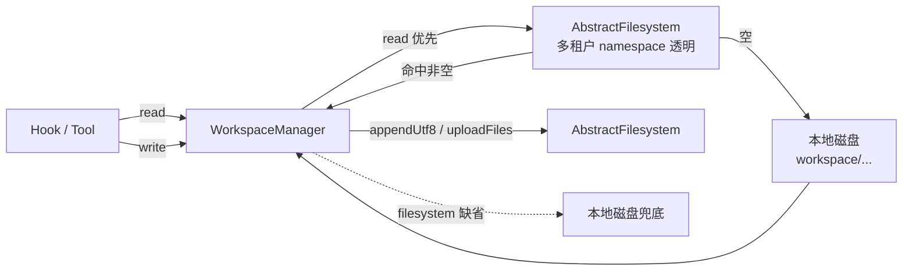

# 工作区（Workspace）

## 作用

工作区是 `HarnessAgent` 的"地基"：人格、长期记忆、领域知识、子 agent 规格、会话历史、技能定义统一以**目录结构 + Markdown** 的形式落地，不再散落在代码里。

agent 每次推理时，工作区里的几个关键文件会被自动注入到 system prompt；运行过程中的记忆与会话也会按既定路径回写到这里。

## 触发

| 时机 | 动作 |
|------|------|
| `HarnessAgent.build()` | `WorkspaceManager.validate()` 检查目录与 `AGENTS.md` 是否存在，缺失只 warn |
| 每次 `call()` 推理前 | `WorkspaceContextHook` 读 `AGENTS.md` / `MEMORY.md` / `knowledge/` / 额外文件并注入 system prompt |
| 压缩 / 调用结束 | `MemoryFlushHook`、`SessionPersistenceHook` 等通过 `WorkspaceManager` 写回 `memory/`、`agents/.../sessions/` |

## 目录结构

```
workspace/                       ← 默认 .agentscope/workspace
├── AGENTS.md                    ← 人格 / 行为约定（每次注入全文）
├── MEMORY.md                    ← 整理过的长期记忆（每次注入，受 token 预算）
├── knowledge/
│   ├── KNOWLEDGE.md             ← 领域知识入口
│   └── *                        ← 其他参考文件，按需 read_file 打开
├── memory/
│   ├── YYYY-MM-DD.md            ← 每日记忆流水账（追加，由 MemoryFlushManager 写入）
│   └── .consolidation_state     ← MemoryConsolidator 内部状态
├── skills/<skill-name>/SKILL.md ← 自定义技能
├── subagent.yml                 ← 子 agent 规格（可选）
└── agents/<agentId>/
    └── sessions/
        ├── sessions.json        ← 会话索引（id / summary / updatedAt）
        ├── <sessionId>.jsonl    ← LLM 可见的压缩上下文
        └── <sessionId>.log.jsonl← 完整对话日志（追加）
```

> 子 agent 还支持 `workspace/subagents/*.md` 自动发现，详见 [子 Agent](./subagent.md)。

## 关键逻辑

### 两层读取 / 写回

`WorkspaceManager` 是无状态访问器，所有读写都遵循同一规约：



要点：

- **读路径**：`AbstractFilesystem` 优先 → 本地磁盘兜底，让多租户场景对调用方透明
- **写路径**：默认全部走 `AbstractFilesystem`；未配置时 fallback 本地磁盘
- **List 操作**（`listKnowledgeFiles` / `listMemoryFilePaths` / `listSessionLogFiles`）取两层并集去重，避免漏文件

### system prompt 注入内容

`WorkspaceContextHook`（priority 900）在 `PreReasoningEvent` 拼装一段固定结构的文本，合并到第一条 SYSTEM 消息：

| 段落 | 来源 | Token 预算 |
|------|------|------------|
| `## Session Context` | 模板生成（日期、OS、workspace 路径、`runtimeContext.sessionId`） | 不限 |
| `## Workspace` 等 guidance | 内置模板 | 不限 |
| `<loaded_context>` XML 块 | — | — |
| ↳ `<agents_context>` | `AGENTS.md` | 全文 |
| ↳ `<memory_context>` | `MEMORY.md` | 受 `maxContextTokens` 限制 |
| ↳ `<domain_knowledge_context>` | `knowledge/KNOWLEDGE.md` + `listKnowledgeFiles()` 列表 | 全文 + 路径目录 |
| ↳ `<{rel_path}>` | 每个 `additionalContextFile` | 全文 |

`maxContextTokens` 默认 `8000`（按 `chars/4` 估算）。当 `MEMORY.md` 估算超出"剩余预算"时，按字符截断并附 `... (memory truncated — use memory_search for older entries) ...` 尾注，提示 agent 改走 `memory_search`。

### 关键 API

```java
WorkspaceManager wm = new WorkspaceManager(workspace, abstractFilesystem);

wm.readAgentsMd();                 // 两层读
wm.readMemoryMd();
wm.readKnowledgeMd();              // 注意：读 knowledge/KNOWLEDGE.md
wm.readManagedWorkspaceFileUtf8(rel); // 任意工作区相对路径，做 path traversal 校验

wm.listKnowledgeFiles();           // 两层并集
wm.listMemoryFilePaths();
wm.listSessionLogFiles();

wm.appendUtf8WorkspaceRelative(rel, content);  // 走 AbstractFilesystem
wm.updateSessionIndex(agentId, sessionId, summary); // 维护 sessions.json
```

## 配置

```java
HarnessAgent agent = HarnessAgent.builder()
    .name("MyAgent")
    .model(model)
    .workspace(Paths.get(".agentscope/workspace"))   // 不传则用默认
    .additionalContextFile("SOUL.md")                // 任意工作区相对路径
    .additionalContextFile("PREFERENCES.md")
    .maxContextTokens(8000)                          // 控制 MEMORY 的注入上限
    .build();
```

`AGENTS.md` 缺失时 agent 仍可工作，只会丢失 persona 段，建议至少写一份最小骨架（参考 [overview.md](./overview.md) 的 quickstart）。

## 相关文档

- [架构](./architecture.md) — `WorkspaceContextHook` 在 call() 生命周期里的位置
- [文件系统](./filesystem.md) — 两层读路径中"上层"的实现
- [记忆](./memory.md) — `MEMORY.md` / `memory/*.md` 怎么生成与维护
- [会话](./session.md) — `agents/<agentId>/sessions/` 的细节
