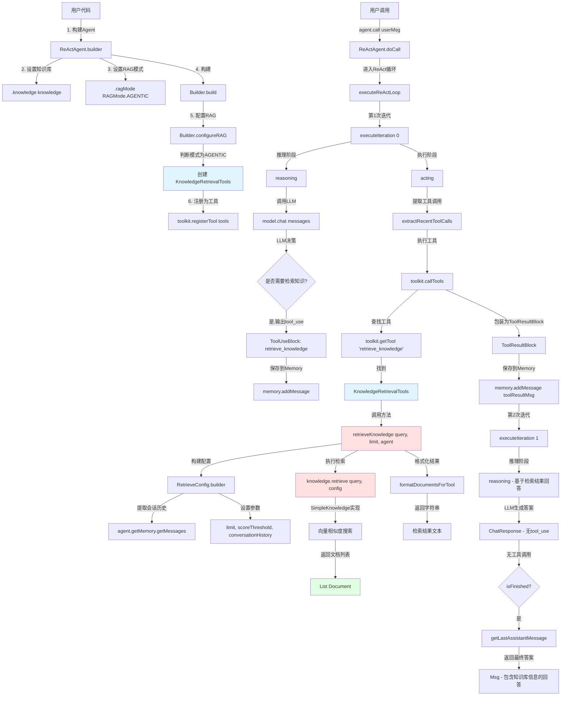

# AgentScope RAG 模式调用指南

## 概述

AgentScope 支持三种 RAG 模式：

| 模式 | 机制 | 触发方式 | 适用场景 |
|------|------|---------|----------|
| **AGENTIC** | Tool 工具 | LLM 主动决策 | 复杂任务，需选择性检索 |
| **GENERIC** | Hook 拦截 | 每次推理前自动 | 简单问答，总是需要知识 |
| **NONE** | 禁用 | 不检索 | 不需要外部知识 |

---

## 调用树可视化



---

## 详细调用流程

### 阶段 1: Agent 构建时知识库注入

**用户代码**:
```java
ReActAgent agent = ReActAgent.builder()
    .name("RAGAgent")
    .model(model)
    .toolkit(new Toolkit())
    .memory(new InMemoryMemory())
    .knowledge(knowledge)              // ← 步骤1: 添加知识库
    .ragMode(RAGMode.AGENTIC)          // ← 步骤2: 设置为Agentic模式
    .build();
```

**内部执行** - `ReActAgent.Builder.configureRAG()` (第1229-1257行):
```java
private void configureRAG() {
    // 聚合多个知识库(如果有)
    Knowledge aggregatedKnowledge;
    if (knowledgeBases.size() == 1) {
        aggregatedKnowledge = knowledgeBases.get(0);
    } else {
        aggregatedKnowledge = buildAggregatedKnowledge();
    }

    // 根据模式配置
    switch (ragMode) {
        case AGENTIC -> {
            // ← 步骤3: 创建知识检索工具
            KnowledgeRetrievalTools tools = 
                new KnowledgeRetrievalTools(aggregatedKnowledge);
            // ← 步骤4: 注册为工具,LLM可以主动调用
            toolkit.registerTool(tools);
        }
    }
}
```

**关键点**: 
- 知识库被包装成 `retrieve_knowledge` 工具
- 工具注册到 `Toolkit`，与其他工具(如文件工具、计算器)平等
- LLM 在推理时可以"看到"这个工具的描述

---

### 阶段 2: ReAct 循环 - 推理阶段 (Reasoning)

**执行代码** - `ReasoningPipeline.execute()`:
```java
private Mono<Void> reasoning(StructuredOutputHandler handler) {
    return new ReasoningPipeline(handler).execute();
}

// ← 步骤5: 构建发送给LLM的消息
List<Msg> contextMessages = memory.getMessages();  // 包含用户问题
List<ToolSchema> tools = toolkit.getToolSchemas();  // 包含 retrieve_knowledge 工具

// ← 步骤6: LLM推理
ChatResponse response = model.chat(contextMessages, tools);
```

**LLM 决策输出示例**:
```json
{
  "role": "assistant",
  "content": [
    {
      "type": "tool_use",
      "name": "retrieve_knowledge",
      "input": {
        "query": "What is AgentScope?",
        "limit": 5
      }
    }
  ]
}
```

**工具描述(LLM看到的信息)**:
```
Tool Name: retrieve_knowledge
Description: Retrieve relevant documents from knowledge base. Use this tool 
             when you need to find specific information or when user asks 
             questions about stored knowledge.
Parameters:
  - query (string, required): The search query to find relevant documents
  - limit (integer, optional): Maximum number of documents to retrieve (default: 5)
```

---

### 阶段 3: ReAct 循环 - 执行阶段 (Acting)

**执行代码** - `ActingPipeline.execute()` (第481-495行):
```java
Mono<Void> execute() {
    // ← 步骤7: 提取工具调用
    List<ToolUseBlock> toolCalls = extractRecentToolCalls();
    // toolCalls = [ToolUseBlock(name="retrieve_knowledge", input={...})]
    
    if (toolCalls.isEmpty()) {
        return Mono.empty();
    }

    toolkit.setChunkCallback(
        (toolUse, chunk) -> hookNotifier.notifyActingChunk(toolUse, chunk).subscribe());

    // ← 步骤8: 执行工具
    return toolkit.callTools(toolCalls, toolExecutionConfig, 
                            ReActAgent.this, toolExecutionContext)
        .flatMapMany(responses -> processToolResults(toolCalls, responses))
        .then()
        .then(checkInterruptedAsync());
}
```

**Toolkit 工具查找与执行**:
```java
// ← 步骤9: 查找工具
AgentTool tool = toolkit.getTool("retrieve_knowledge");
// tool → KnowledgeRetrievalTools 实例

// ← 步骤10: 解析参数并调用
Map<String, Object> input = toolCall.getInput();
String query = (String) input.get("query");      // "What is AgentScope?"
Integer limit = (Integer) input.get("limit");    // 5

String result = tool.execute(params);
```

---

### 阶段 4: 知识检索工具执行

**核心方法** - `KnowledgeRetrievalTools.retrieveKnowledge()` (第97-135行):
```java
@Tool(name = "retrieve_knowledge", 
      description = "Retrieve relevant documents from knowledge base...")
public String retrieveKnowledge(
        @ToolParam(name = "query", 
                   description = "The search query to find relevant documents")
        String query,
        
        @ToolParam(name = "limit", 
                   description = "Maximum number of documents to retrieve (default: 5)",
                   required = false)
        Integer limit,
        
        Agent agent) {  // ← 框架自动注入
    
    // ← 步骤11: 设置默认值
    if (limit == null) {
        limit = 5;
    }
    
    // ← 步骤12: 提取会话历史(用于上下文感知检索)
    List<Msg> conversationHistory = null;
    if (agent instanceof ReActAgent reActAgent) {
        conversationHistory = reActAgent.getMemory().getMessages();
    }
    
    // ← 步骤13: 构建检索配置
    RetrieveConfig config = RetrieveConfig.builder()
        .limit(limit)                              // 5个文档
        .scoreThreshold(0.5)                       // 相似度阈值
        .conversationHistory(conversationHistory)  // 对话历史
        .build();
    
    // ← 步骤14: 执行向量检索
    return knowledge.retrieve(query, config)
        .map(this::formatDocumentsForTool)
        .onErrorReturn("Failed to retrieve knowledge for query: " + query)
        .block();  // 转为同步调用
}
```

**向量检索执行** - `SimpleKnowledge.retrieve()`:
```java
public Mono<List<Document>> retrieve(String query, RetrieveConfig config) {
    // ← 步骤15: 将查询文本转为向量
    EmbeddingResponse embeddingResp = embeddingModel.embed(List.of(query));
    float[] queryVector = embeddingResp.getData().get(0).getEmbedding();
    // queryVector = [0.23, -0.45, 0.67, ...] (1024维)
    
    // ← 步骤16: 向量存储中搜索(余弦相似度)
    List<Document> results = embeddingStore.search(
        queryVector,
        config.getLimit(),       // 最多返回5个
        config.getScoreThreshold() // 分数 >= 0.5
    );
    
    // ← 步骤17: 返回相关文档
    return Mono.just(results);
}
```

**检索结果示例**:
```java
List<Document> results = [
    Document(
        score=0.95,
        metadata=DocumentMetadata(
            content="AgentScope is a multi-agent framework...",
            documentId="doc-001",
            chunkId="chunk-1"
        )
    ),
    Document(
        score=0.88,
        metadata=DocumentMetadata(
            content="AgentScope supports RAG with SimpleKnowledge...",
            documentId="doc-002",
            chunkId="chunk-3"
        )
    )
]
```

**格式化为 LLM 可读文本** - `formatDocumentsForTool()` (第146-165行):
```java
private String formatDocumentsForTool(List<Document> documents) {
    if (documents == null || documents.isEmpty()) {
        return "No relevant documents found in the knowledge base.";
    }

    StringBuilder sb = new StringBuilder();
    sb.append("Retrieved ").append(documents.size()).append(" relevant document(s):\n\n");

    for (int i = 0; i < documents.size(); i++) {
        Document doc = documents.get(i);
        sb.append("Document ").append(i + 1);
        if (doc.getScore() != null) {
            sb.append(" (Score: ").append(String.format("%.3f", doc.getScore())).append(")");
        }
        sb.append(":\n");
        sb.append(doc.getMetadata().getContentText()).append("\n\n");
    }

    return sb.toString();
}
```

**格式化结果**:
```
Retrieved 2 relevant document(s):

Document 1 (Score: 0.950):
AgentScope is a multi-agent framework that provides comprehensive support 
for building AI agents with memory, tools, and RAG capabilities.

Document 2 (Score: 0.880):
AgentScope supports RAG with SimpleKnowledge, which integrates embedding 
models and vector stores for efficient document retrieval.
```

---

### 阶段 5: 工具结果保存到 Memory

**处理工具执行结果** - `ActingPipeline.processSingleToolResult()` (第503-515行):
```java
private Mono<Void> processSingleToolResult(
        ToolUseBlock toolCall, 
        ToolResultBlock result) {
    
    return hookNotifier.notifyPostActing(toolCall, result)
        .doOnNext(processedResult -> {
            // ← 步骤18: 构建工具结果消息
            Msg toolMsg = ToolResultMessageBuilder.buildToolResultMsg(
                processedResult, 
                toolCall, 
                getName()
            );
            
            // ← 步骤19: 保存到Memory
            memory.addMessage(toolMsg);
        })
        .then();
}
```

**工具结果消息结构**:
```java
Msg toolMsg = {
    "role": "tool_result",
    "name": "retrieve_knowledge",
    "content": [
        ToolResultBlock(
            toolUseId="tool_call_001",
            content="Retrieved 2 relevant document(s):\n\n" +
                    "Document 1 (Score: 0.950):\n" +
                    "AgentScope is a multi-agent framework...\n\n" +
                    "Document 2 (Score: 0.880):\n" +
                    "AgentScope supports RAG..."
        )
    ]
}
```

---

### 阶段 6: 第二次推理 - 基于检索结果回答

**进入第2次迭代** - `executeIteration(1, handler)`:
```java
private Mono<Msg> executeIteration(int iter, StructuredOutputHandler handler) {
    if (iter >= maxIters) {
        return summarizing(handler);
    }

    return checkInterruptedAsync()
        .then(reasoning(handler))  // ← 步骤20: 第2次推理
        .then(Mono.defer(this::checkInterruptedAsync))
        .then(Mono.defer(() -> actingOrFinish(iter, handler)));
}
```

**此时 Memory 中的完整消息历史**:
```java
List<Msg> messages = [
    // 用户问题
    Msg(role=USER, content="What is AgentScope?"),
    
    // 第1次推理 - LLM决定调用工具
    Msg(role=ASSISTANT, content=[
        ToolUseBlock(name="retrieve_knowledge", 
                     input={query: "What is AgentScope?", limit: 5})
    ]),
    
    // 工具执行结果
    Msg(role=TOOL_RESULT, name="retrieve_knowledge", content=[
        ToolResultBlock(content="Retrieved 2 relevant document(s):\n\n" +
                                "Document 1 (Score: 0.950):\n" +
                                "AgentScope is a multi-agent framework...\n\n" +
                                "Document 2 (Score: 0.880):\n" +
                                "AgentScope supports RAG...")
    ])
]
```

**第2次推理 - LLM 基于检索结果生成答案**:
```java
// ← 步骤21: LLM看到完整上下文(包括检索结果)
ChatResponse finalResponse = model.chat(messages, tools);

// LLM 输出示例:
finalResponse = {
    "role": "assistant",
    "content": [
        TextBlock(
            text="Based on the retrieved documents, AgentScope is a " +
                 "multi-agent framework that provides comprehensive support " +
                 "for building AI agents. It includes features like memory " +
                 "management, tool integration, and RAG (Retrieval-Augmented " +
                 "Generation) capabilities. The framework uses SimpleKnowledge " +
                 "to integrate embedding models and vector stores for efficient " +
                 "document retrieval."
        )
    ]
}
```

**检查循环终止条件** - `isFinished()` (第285-294行):
```java
private boolean isFinished() {
    List<ToolUseBlock> recentToolCalls = extractRecentToolCalls();

    // ← 步骤22: 没有工具调用,说明LLM已给出最终答案
    if (recentToolCalls.isEmpty()) {
        return true;  // 循环结束
    }

    // 工具调用都找不到对应Tool,也算结束
    return recentToolCalls.stream()
        .noneMatch(toolCall -> toolkit.getTool(toolCall.getName()) != null);
}
```

**返回最终消息**:
```java
// ← 步骤23: 提取最后的助手消息作为最终答案
if (isFinished()) {
    return getLastAssistantMessage();
}
```

---

## 完整示例场景

### 用户询问: "What is AgentScope?"

#### 时间线:

**T0: 用户消息入库**
```java
Msg userMsg = Msg.builder()
    .role(MsgRole.USER)
    .content(TextBlock.builder().text("What is AgentScope?").build())
    .build();

memory.addMessage(userMsg);  // Memory: [USER: "What is AgentScope?"]
```

---

**T1: 第1次迭代 - 推理阶段**

```java
// LLM 输入:
contextMessages = [
    Msg(role=USER, content="What is AgentScope?")
]

availableTools = [
    ToolSchema(name="retrieve_knowledge", 
               description="Retrieve relevant documents from knowledge base...",
               parameters={...})
]

// LLM 决策: "需要从知识库检索信息"
ChatResponse response = {
    "role": "assistant",
    "content": [
        ToolUseBlock(
            id="tool_call_001",
            name="retrieve_knowledge",
            input={
                "query": "What is AgentScope?",
                "limit": 5
            }
        )
    ]
}

// Memory: [USER: ..., ASSISTANT: tool_use(...)]
```

---

**T2: 第1次迭代 - 执行阶段**

```java
// 1. 提取工具调用
toolCalls = [ToolUseBlock(name="retrieve_knowledge", input={...})]

// 2. 执行工具
tool = toolkit.getTool("retrieve_knowledge")  // → KnowledgeRetrievalTools
result = tool.execute({
    "query": "What is AgentScope?",
    "limit": 5
})

// 3. 向量检索
queryVector = embeddingModel.embed("What is AgentScope?")
documents = vectorStore.search(queryVector, limit=5, threshold=0.5)

// 返回结果:
documents = [
    Document(score=0.95, content="AgentScope is a multi-agent framework..."),
    Document(score=0.88, content="AgentScope supports RAG..."),
    Document(score=0.82, content="The framework provides memory management..."),
    Document(score=0.78, content="AgentScope integrates with vector databases..."),
    Document(score=0.72, content="ReActAgent is the core agent implementation...")
]

// 4. 格式化结果
formattedResult = """
Retrieved 5 relevant document(s):

Document 1 (Score: 0.950):
AgentScope is a multi-agent framework...

Document 2 (Score: 0.880):
AgentScope supports RAG...

Document 3 (Score: 0.820):
The framework provides memory management...

Document 4 (Score: 0.780):
AgentScope integrates with vector databases...

Document 5 (Score: 0.720):
ReActAgent is the core agent implementation...
"""

// 5. 保存工具结果到Memory
toolResultMsg = Msg(role=TOOL_RESULT, content=formattedResult)
memory.addMessage(toolResultMsg)

// Memory: [USER: ..., ASSISTANT: tool_use(...), TOOL_RESULT: "Retrieved 5..."]
```

---

**T3: 第2次迭代 - 推理阶段**

```java
// LLM 输入(完整上下文):
contextMessages = [
    Msg(role=USER, content="What is AgentScope?"),
    Msg(role=ASSISTANT, content=[ToolUseBlock(name="retrieve_knowledge", ...)]),
    Msg(role=TOOL_RESULT, content="Retrieved 5 relevant document(s):...")
]

// LLM 决策: "已有足够信息,直接回答"
ChatResponse finalResponse = {
    "role": "assistant",
    "content": [
        TextBlock(
            text="Based on the retrieved documents, AgentScope is a " +
                 "multi-agent framework that provides comprehensive support " +
                 "for building AI agents. Key features include:\n\n" +
                 "1. **Multi-Agent Architecture**: Enables building complex " +
                 "   agent systems\n" +
                 "2. **RAG Support**: Integrates with vector databases for " +
                 "   knowledge retrieval\n" +
                 "3. **Memory Management**: Built-in memory systems for " +
                 "   conversation context\n" +
                 "4. **ReActAgent**: Core implementation following the ReAct " +
                 "   (Reasoning + Acting) pattern\n" +
                 "5. **Tool Integration**: Seamless integration with external tools\n\n" +
                 "The framework is designed to make building intelligent agents " +
                 "more accessible and efficient."
        )
    ]
}

// Memory: [USER: ..., ASSISTANT: tool_use(...), TOOL_RESULT: ..., ASSISTANT: "Based on..."]
```

---

**T4: 循环终止检查**

```java
// 检查最新的助手消息
lastAssistantMsg = finalResponse  // 无 tool_use,只有 text

// isFinished() = true (无工具调用)
return getLastAssistantMessage()  // 返回 finalResponse
```

---

**T5: 返回给用户**

```java
Msg finalAnswer = {
    "role": "assistant",
    "name": "RAGAgent",
    "content": [
        TextBlock(
            text="Based on the retrieved documents, AgentScope is a " +
                 "multi-agent framework that provides comprehensive support..."
        )
    ]
}

// 用户看到的最终回答
System.out.println(finalAnswer.getContent());
```

---

### 执行流程图

```
用户输入: "What is AgentScope?"
    ↓
[迭代1 - Reasoning]
    ↓
LLM 决策: 调用 retrieve_knowledge("What is AgentScope?", 5)
    ↓
[迭代1 - Acting]
    ↓
执行工具 → 向量检索 → 返回5个相关文档
    ↓
保存到 Memory: TOOL_RESULT
    ↓
[迭代2 - Reasoning]
    ↓
LLM 看到检索结果 → 生成最终答案(无工具调用)
    ↓
[循环终止检查]
    ↓
isFinished() = true → 返回最终答案
    ↓
输出给用户
```

---

### Memory 完整快照

```java
// 对话结束时 Memory 中的完整消息列表
List<Msg> finalMemory = [
    // [0] 用户问题
    Msg(
        role=USER,
        name="User",
        content=[TextBlock(text="What is AgentScope?")]
    ),
    
    // [1] 第1次推理 - 决定检索知识
    Msg(
        role=ASSISTANT,
        name="RAGAgent",
        content=[
            ToolUseBlock(
                id="tool_call_001",
                name="retrieve_knowledge",
                input={query: "What is AgentScope?", limit: 5}
            )
        ]
    ),
    
    // [2] 工具执行结果
    Msg(
        role=TOOL_RESULT,
        name="retrieve_knowledge",
        content=[
            ToolResultBlock(
                toolUseId="tool_call_001",
                content="Retrieved 5 relevant document(s):\n\n" +
                        "Document 1 (Score: 0.950):\n" +
                        "AgentScope is a multi-agent framework...\n\n" +
                        "Document 2 (Score: 0.880):\n" +
                        "AgentScope supports RAG...\n\n" +
                        "..."
            )
        ]
    ),
    
    // [3] 第2次推理 - 基于检索结果的最终答案
    Msg(
        role=ASSISTANT,
        name="RAGAgent",
        content=[
            TextBlock(
                text="Based on the retrieved documents, AgentScope is a " +
                     "multi-agent framework that provides comprehensive support " +
                     "for building AI agents. Key features include:\n\n" +
                     "1. **Multi-Agent Architecture**: Enables building complex " +
                     "   agent systems\n" +
                     "..."
            )
        ]
    )
]
```

---

## 关键特性

### 1. Agent 主动决策

**LLM 自主判断**:
```java
// LLM 内部推理过程(伪代码):
if (用户问题需要外部知识) {
    调用 retrieve_knowledge(query, limit);
} else if (可以基于已有信息回答) {
    直接生成答案;
}
```

**优势**:
- ✅ 灵活性高: Agent 决定何时检索
- ✅ 避免冗余: 不需要知识时不检索
- ✅ 多次检索: 可在一次对话中多次调用工具
- ✅ 上下文适配: 根据对话流程调整检索策略

**示例 - 多次检索**:
```
用户: "比较 AgentScope 和 LangChain 的 RAG 实现"
  ↓
LLM 推理: 需要分别检索两者的信息
  ↓
调用1: retrieve_knowledge("AgentScope RAG", 3)
  ↓
调用2: retrieve_knowledge("LangChain RAG", 3)
  ↓
LLM 基于两次检索结果进行对比分析
  ↓
输出对比结果
```

---

### 2. 工具与其他 Tool 平等

**工具注册**:
```java
Toolkit toolkit = new Toolkit();

// 知识检索工具
toolkit.registerTool(new KnowledgeRetrievalTools(knowledge));

// 文件操作工具
toolkit.registerTool(new FileTools());

// 计算器工具
toolkit.registerTool(new CalculatorTools());

// Web搜索工具
toolkit.registerTool(new WebSearchTools());

// LLM 可以自由选择使用哪个工具
```

**LLM 看到的工具列表**:
```json
{
  "tools": [
    {
      "name": "retrieve_knowledge",
      "description": "Retrieve relevant documents from knowledge base...",
      "parameters": {...}
    },
    {
      "name": "read_file",
      "description": "Read content from a file...",
      "parameters": {...}
    },
    {
      "name": "calculate",
      "description": "Perform mathematical calculations...",
      "parameters": {...}
    },
    {
      "name": "web_search",
      "description": "Search the web for information...",
      "parameters": {...}
    }
  ]
}
```

**LLM 选择示例**:
```
用户: "从文件 data.txt 读取内容,然后在知识库中搜索相关信息"
  ↓
LLM 决策链:
  1. 调用 read_file("data.txt") → 获取文件内容
  2. 调用 retrieve_knowledge(文件内容, 5) → 检索相关文档
  3. 综合两者信息生成答案
```

---

### 3. 上下文感知检索

**提取对话历史**:
```java
// KnowledgeRetrievalTools.retrieveKnowledge()
List<Msg> conversationHistory = null;
if (agent instanceof ReActAgent reActAgent) {
    conversationHistory = reActAgent.getMemory().getMessages();
}

RetrieveConfig config = RetrieveConfig.builder()
    .limit(limit)
    .scoreThreshold(0.5)
    .conversationHistory(conversationHistory)  // ← 传递对话历史
    .build();
```

**支持多轮对话的知识库(如 Bailian)**:
```java
// BailianKnowledge 实现
public Mono<List<Document>> retrieve(String query, RetrieveConfig config) {
    List<Msg> history = config.getConversationHistory();
    
    // 将对话历史转换为 Bailian API 格式
    List<BailianMessage> bailianHistory = convertToBailianMessages(history);
    
    // 调用 Bailian API(支持多轮对话上下文)
    return bailianClient.retrieve(
        query, 
        bailianHistory,  // ← 利用对话历史提高检索准确性
        config.getLimit()
    );
}
```

**多轮对话示例**:
```
[轮1]
用户: "AgentScope 支持哪些向量数据库?"
Agent: retrieve_knowledge("AgentScope 向量数据库支持")
      → 回答: "支持 InMemory, Milvus, Weaviate 等"

[轮2]
用户: "其中哪个性能最好?"  // ← 代词 "其中" 需要上下文
Agent: retrieve_knowledge(
          query="向量数据库性能比较",
          conversationHistory=[轮1的对话]  // ← 知识库利用上下文理解 "其中" 指什么
       )
      → 回答: "Milvus 在大规模数据场景下性能最佳..."
```

---

### 4. 结果自动融入对话

**Memory 中的消息流**:
```
[USER] → [ASSISTANT: tool_use] → [TOOL_RESULT] → [ASSISTANT: answer]
  ↓            ↓                      ↓                  ↓
问题      决定检索知识          检索结果           基于结果的答案
```

**形成完整推理链路**:
```java
// 最终 Memory 包含完整的推理过程
List<Msg> memory = [
    Msg(role=USER, content="问题"),
    Msg(role=ASSISTANT, content=[ToolUseBlock(...)]),     // LLM 决策
    Msg(role=TOOL_RESULT, content="检索结果"),             // 工具输出
    Msg(role=ASSISTANT, content=[TextBlock("答案")])      // 最终回答
]

// 这使得:
// 1. 对话历史完整可追溯
// 2. 后续轮次可引用之前的检索结果
// 3. 支持会话持久化与恢复
```

**可追溯性示例**:
```
用户: "为什么你说 AgentScope 支持 RAG?"
       ↑
Agent 可以引用 Memory 中之前的 TOOL_RESULT 消息:
  "根据我之前检索的第2个文档(Score: 0.880),文档明确提到
   'AgentScope supports RAG with SimpleKnowledge...'，因此..."
```

---

### 5. 错误处理与重试

**工具执行失败**:
```java
// KnowledgeRetrievalTools.retrieveKnowledge()
return knowledge.retrieve(query, config)
    .map(this::formatDocumentsForTool)
    .onErrorReturn("Failed to retrieve knowledge for query: " + query)  // ← 错误处理
    .block();
```

**LLM 处理错误结果**:
```
[迭代1]
LLM: 调用 retrieve_knowledge("复杂查询@@##")
Tool: 返回 "Failed to retrieve knowledge for query: 复杂查询@@##"
Memory: [TOOL_RESULT: "Failed to retrieve..."]

[迭代2]
LLM 看到错误信息 → 决策:
  "抱歉,我无法从知识库中检索到相关信息。
   可能是查询格式有误或知识库中没有相关内容。
   您可以重新描述您的问题吗?"
```

---

### 6. 性能优化: 向量检索

**检索配置**:
```java
RetrieveConfig config = RetrieveConfig.builder()
    .limit(5)                // ← 限制返回数量(避免上下文过长)
    .scoreThreshold(0.5)     // ← 相似度阈值(过滤不相关文档)
    .build();
```

**向量存储搜索**:
```java
// InMemoryStore.search()
public List<Document> search(float[] queryVector, int limit, double threshold) {
    return documents.stream()
        .map(doc -> {
            // 计算余弦相似度
            double score = cosineSimilarity(queryVector, doc.getVector());
            doc.setScore(score);
            return doc;
        })
        .filter(doc -> doc.getScore() >= threshold)  // ← 过滤低分文档
        .sorted(Comparator.comparing(Document::getScore).reversed())
        .limit(limit)  // ← 只返回 top-k
        .toList();
}
```

**效果**:
- ✅ 减少 Token 消耗: 只返回最相关的文档
- ✅ 提高响应速度: 限制文档数量
- ✅ 提升准确性: 过滤不相关内容

---

## 与 GENERIC 模式对比

| 维度 | **AGENTIC 模式** | **GENERIC 模式** |
|-----|-----------------|-----------------|
| **实现机制** | Tool (工具注册) | Hook (事件拦截) |
| **触发方式** | LLM 主动决策调用工具 | 每次推理前自动检索 |
| **触发时机** | 推理阶段 LLM 输出 tool_use | PreReasoningEvent Hook 触发 |
| **检索次数** | 按需,可 0 次或多次 | 每次推理前必定检索 1 次 |
| **灵活性** | ⭐⭐⭐⭐⭐ 高,Agent 完全控制 | ⭐⭐ 低,固定逻辑 |
| **适用场景** | 复杂任务,需选择性检索 | 简单问答,总是需要知识 |
| **多轮对话** | ✅ 支持,Agent 可引用之前结果 | ⚠️ 每轮独立检索,无记忆 |
| **工具组合** | ✅ 可与其他工具自由组合 | ❌ 独立运行,无工具协同 |
| **Token 消耗** | ⭐⭐⭐ 中等(仅需要时检索) | ⭐⭐ 较高(每次都检索) |
| **响应延迟** | ⭐⭐⭐⭐ 较低(按需检索) | ⭐⭐⭐ 中等(每次都检索) |
| **实现复杂度** | ⭐⭐⭐⭐ 较高(依赖 LLM 决策) | ⭐⭐ 简单(固定逻辑) |
| **可控性** | ⭐⭐⭐ 中等(依赖 LLM 能力) | ⭐⭐⭐⭐⭐ 高(确定性行为) |

---

### 代码对比

#### **AGENTIC 模式配置**:
```java
// ReActAgent.Builder.configureRAG() - case AGENTIC
case AGENTIC -> {
    // 创建知识检索工具
    KnowledgeRetrievalTools tools = 
        new KnowledgeRetrievalTools(aggregatedKnowledge);
    
    // 注册为工具,LLM 可主动调用
    toolkit.registerTool(tools);
}
```

#### **GENERIC 模式配置**:
```java
// ReActAgent.Builder.configureRAG() - case GENERIC
case GENERIC -> {
    // 创建 Hook,拦截 PreReasoningEvent
    GenericRAGHook ragHook = new GenericRAGHook(
        aggregatedKnowledge, 
        retrieveConfig, 
        enableOnlyForUserQueries
    );
    
    // 注册 Hook,每次推理前自动触发
    hooks.add(ragHook);
}
```

---

### 执行流程对比

#### **AGENTIC 模式**:
```
用户问题 → [推理1] → LLM 决策调用工具
                  ↓
            [执行1] → 执行 retrieve_knowledge
                  ↓
            [推理2] → 基于检索结果回答
                  ↓
              返回答案
```

#### **GENERIC 模式**:
```
用户问题 → [PreReasoningHook] → 自动检索知识
                             ↓
                        增强后的消息
                             ↓
             [推理] → LLM 基于增强消息回答
                  ↓
              返回答案
```

---

### 使用场景建议

#### **推荐使用 AGENTIC 模式**:
1. ✅ 需要 Agent 自主决策何时检索知识
2. ✅ 任务可能不需要知识库(节省 Token)
3. ✅ 需要多次检索或与其他工具配合
4. ✅ 复杂的多轮对话场景
5. ✅ 需要追溯 Agent 的推理过程

**示例**:
```java
// 场景: 技术支持 Agent
// 用户可能问技术问题(需要知识库),也可能闲聊(不需要)
ReActAgent supportAgent = ReActAgent.builder()
    .name("TechSupport")
    .sysPrompt("You are a technical support assistant. " +
               "Use retrieve_knowledge when users ask technical questions.")
    .model(model)
    .knowledge(technicalDocsKnowledge)
    .ragMode(RAGMode.AGENTIC)  // ← Agent 自主判断
    .build();

// 对话1:
// 用户: "你好" → Agent 直接回复,不检索
// 对话2:
// 用户: "如何配置 RAG?" → Agent 调用 retrieve_knowledge
```

#### **推荐使用 GENERIC 模式**:
1. ✅ 每次都需要知识库信息
2. ✅ 简单的问答场景
3. ✅ 需要确定性行为(不依赖 LLM 决策)
4. ✅ 快速原型开发

**示例**:
```java
// 场景: 产品手册查询 Agent
// 用户问题必然需要查询产品知识
ReActAgent manualAgent = ReActAgent.builder()
    .name("ManualAssistant")
    .sysPrompt("Answer questions based on the product manual.")
    .model(model)
    .knowledge(productManualKnowledge)
    .ragMode(RAGMode.GENERIC)  // ← 每次自动检索
    .retrieveConfig(RetrieveConfig.builder().limit(3).build())
    .build();
```

---

## 代码引用

### 核心类与方法

| 文件路径 | 关键方法/类 | 行号 | 说明 |
|---------|-----------|------|------|
| `ReActAgent.java` | `Builder.configureRAG()` | 1229-1257 | RAG 模式配置入口 |
| `ReActAgent.java` | `reasoning()` | 248-250 | 推理阶段入口 |
| `ReActAgent.java` | `acting()` | 255-257 | 执行阶段入口 |
| `ReActAgent.java` | `ActingPipeline.execute()` | 481-495 | 工具执行流程 |
| `ReActAgent.java` | `processSingleToolResult()` | 503-515 | 工具结果处理 |
| `KnowledgeRetrievalTools.java` | `retrieveKnowledge()` | 97-135 | 知识检索工具方法 |
| `KnowledgeRetrievalTools.java` | `formatDocumentsForTool()` | 146-165 | 结果格式化 |
| `RAGMode.java` | `AGENTIC` | 38-43 | AGENTIC 模式定义 |
| `RAGMode.java` | `GENERIC` | 29-35 | GENERIC 模式定义 |

---

### 测试用例参考

| 测试文件 | 测试场景 | 行号 |
|---------|---------|------|
| `RAGInMemoryE2ETest.java` | Agentic 模式 PDF 检索 | 283-322 |
| `RAGInMemoryE2ETest.java` | Agentic 模式文本检索 | 325-368 |
| `RAGInMemoryE2ETest.java` | 验证工具自动注册 | 370-441 |
| `ReActAgentRAGConfigTest.java` | Agentic 模式配置测试 | 127-144 |
| `KnowledgeRetrievalToolsTest.java` | 工具方法单元测试 | 120-143 |

---

### 示例代码参考

| 示例文件 | 场景 | 行号 |
|---------|------|------|
| `RAGExample.java` | Agentic 模式演示 | 198-231 |
| `RAGExample.java` | Generic 模式演示 | 152-189 |

---

## 常见问题 (FAQ)

### Q1: Agent 如何知道何时调用 retrieve_knowledge?

**A**: LLM 根据工具描述和用户问题自主判断:

```java
@Tool(
    name = "retrieve_knowledge",
    description = "Retrieve relevant documents from knowledge base. " +
                  "Use this tool when you need to find specific information " +
                  "or when user asks questions about stored knowledge."
)
```

LLM 看到这个描述后,会在遇到需要外部知识的问题时调用该工具。

---

### Q2: 如果 Agent 一直不调用 retrieve_knowledge 怎么办?

**A**: 可以通过以下方式引导:

1. **优化系统提示词**:
```java
.sysPrompt("You are a helpful assistant with access to a knowledge base. " +
           "When users ask questions, ALWAYS use the retrieve_knowledge tool " +
           "to search for relevant information before answering.")
```

2. **用户明确要求**:
```
用户: "在知识库中搜索 AgentScope 的信息"
```

3. **使用 GENERIC 模式**(确保总是检索):
```java
.ragMode(RAGMode.GENERIC)
```

---

### Q3: 可以同时使用多个知识库吗?

**A**: 可以,通过 `knowledges()` 方法:

```java
ReActAgent agent = ReActAgent.builder()
    .name("MultiKBAgent")
    .model(model)
    .knowledge(technicalDocsKB)      // 技术文档知识库
    .knowledge(productManualKB)      // 产品手册知识库
    .knowledge(faqKB)                // FAQ知识库
    .ragMode(RAGMode.AGENTIC)
    .build();

// 内部会聚合为一个 AggregatedKnowledge
// 检索时会同时搜索所有知识库,合并去重后返回 top-k 结果
```

---

### Q4: 如何控制检索结果的数量和质量?

**A**: 通过 `RetrieveConfig`:

```java
RetrieveConfig config = RetrieveConfig.builder()
    .limit(10)                  // 最多返回10个文档
    .scoreThreshold(0.7)        // 只返回相似度 >= 0.7 的文档
    .build();

ReActAgent agent = ReActAgent.builder()
    .name("Agent")
    .model(model)
    .knowledge(knowledge)
    .ragMode(RAGMode.AGENTIC)
    .retrieveConfig(config)     // ← 设置默认检索配置
    .build();
```

---

### Q5: 可以自定义知识检索工具的名称和描述吗?

**A**: 当前版本不支持直接自定义,但可以通过继承实现:

```java
public class CustomKnowledgeTools extends KnowledgeRetrievalTools {
    
    @Tool(
        name = "search_database",  // ← 自定义名称
        description = "Search our internal database for relevant information..."
    )
    @Override
    public String retrieveKnowledge(String query, Integer limit, Agent agent) {
        return super.retrieveKnowledge(query, limit, agent);
    }
}

// 使用自定义工具
toolkit.registerTool(new CustomKnowledgeTools(knowledge));
```

---

### Q6: 如何追踪 Agent 的检索行为?

**A**: 通过 Hook 监听:

```java
Hook monitorHook = new Hook() {
    @Override
    public <T extends HookEvent> Mono<T> onEvent(T event) {
        if (event instanceof PreActingEvent preActing) {
            ToolUseBlock toolUse = preActing.getToolUse();
            if ("retrieve_knowledge".equals(toolUse.getName())) {
                System.out.println("检索查询: " + toolUse.getInput().get("query"));
            }
        } else if (event instanceof PostActingEvent postActing) {
            if ("retrieve_knowledge".equals(postActing.getToolUse().getName())) {
                System.out.println("检索结果: " + postActing.getResult().getContent());
            }
        }
        return Mono.just(event);
    }
};

ReActAgent agent = ReActAgent.builder()
    .name("Agent")
    .model(model)
    .knowledge(knowledge)
    .ragMode(RAGMode.AGENTIC)
    .hook(monitorHook)  // ← 添加监控 Hook
    .build();
```

---

### Q7: 检索失败会影响 Agent 运行吗?

**A**: 不会中断,工具会返回错误信息,LLM 可以处理:

```java
// KnowledgeRetrievalTools.retrieveKnowledge()
return knowledge.retrieve(query, config)
    .map(this::formatDocumentsForTool)
    .onErrorReturn("Failed to retrieve knowledge for query: " + query)  // ← 捕获错误
    .block();

// LLM 会收到类似这样的工具结果:
// "Failed to retrieve knowledge for query: xxx"
// 然后可以回复: "抱歉,我无法从知识库中检索到相关信息..."
```

---

## 最佳实践

### 1. 系统提示词设计

**好的提示词**:
```java
.sysPrompt(
    "You are a technical support assistant with access to a comprehensive " +
    "knowledge base via the retrieve_knowledge tool.\n\n" +
    
    "Guidelines:\n" +
    "1. When users ask technical questions, ALWAYS search the knowledge base first\n" +
    "2. Cite the retrieved documents in your answers (e.g., 'According to Document 1...')\n" +
    "3. If no relevant information is found, clearly state that\n" +
    "4. You can call retrieve_knowledge multiple times for complex questions\n" +
    "5. For casual conversation, you don't need to search the knowledge base"
)
```

---

### 2. 知识库内容组织

**文档分块建议**:
```java
// 推荐: 适中的文档块大小(300-500 tokens)
Document chunk1 = createDocument("doc1-chunk1", 
    "AgentScope is a multi-agent framework. It provides...");  // ~200 tokens

Document chunk2 = createDocument("doc1-chunk2",
    "The ReActAgent is the core implementation. It follows...");  // ~200 tokens

// 避免: 过大的文档块(导致上下文过长)
Document badChunk = createDocument("entire-manual",
    "Complete 50-page manual content...");  // 10000+ tokens ❌
```

---

### 3. 检索参数调优

```java
// 场景1: 需要高召回率(找到所有可能相关的信息)
RetrieveConfig highRecall = RetrieveConfig.builder()
    .limit(10)                  // 返回更多文档
    .scoreThreshold(0.3)        // 降低阈值
    .build();

// 场景2: 需要高精确率(只要最相关的信息)
RetrieveConfig highPrecision = RetrieveConfig.builder()
    .limit(3)                   // 只返回 top-3
    .scoreThreshold(0.8)        // 提高阈值
    .build();

// 场景3: 平衡模式(推荐)
RetrieveConfig balanced = RetrieveConfig.builder()
    .limit(5)
    .scoreThreshold(0.5)
    .build();
```

---

### 4. 性能优化

```java
// 1. 使用流式响应(减少首字延迟)
DashScopeChatModel model = DashScopeChatModel.builder()
    .apiKey(apiKey)
    .modelName("qwen-max")
    .stream(true)  // ← 启用流式
    .build();

// 2. 控制检索数量(减少 Token 消耗)
.retrieveConfig(RetrieveConfig.builder()
    .limit(3)  // ← 只返回 top-3,减少上下文长度
    .build())

// 3. 使用高性能向量数据库
Knowledge knowledge = SimpleKnowledge.builder()
    .embeddingModel(embeddingModel)
    .embeddingStore(new MilvusStore(...))  // ← 替换为 Milvus
    .build();
```

---

### 5. 多知识库管理

```java
// 按主题分离知识库
Knowledge technicalKB = createKnowledge("technical-docs");
Knowledge productKB = createKnowledge("product-manual");
Knowledge faqKB = createKnowledge("faq");

// 方案1: 聚合为单一知识库(简单场景)
ReActAgent agent1 = ReActAgent.builder()
    .name("Agent1")
    .knowledge(technicalKB)
    .knowledge(productKB)
    .knowledge(faqKB)
    .ragMode(RAGMode.AGENTIC)
    .build();

// 方案2: 创建多个专用 Agent(复杂场景)
ReActAgent technicalAgent = ReActAgent.builder()
    .name("TechnicalExpert")
    .knowledge(technicalKB)
    .ragMode(RAGMode.AGENTIC)
    .build();

ReActAgent productAgent = ReActAgent.builder()
    .name("ProductExpert")
    .knowledge(productKB)
    .ragMode(RAGMode.AGENTIC)
    .build();

// 方案3: 使用路由 Agent 分发(最灵活)
// 主 Agent 根据问题类型,调用对应的专家 Agent
```

---

## 参考资源

- **RAG 概念**: [Retrieval-Augmented Generation (RAG)](https://arxiv.org/abs/2005.11401)
- **ReAct 模式**: [ReAct: Synergizing Reasoning and Acting in Language Models](https://arxiv.org/abs/2210.03629)
- **AgentScope 文档**: 项目 README 和示例代码
- **相关代码**:
  - `ReActAgent.java`: ReAct Agent 实现
  - `KnowledgeRetrievalTools.java`: 知识检索工具
  - `RAGMode.java`: RAG 模式定义
  - `RAGExample.java`: 完整示例

---

## 总结

**AGENTIC 模式核心优势**:
1. ✅ **灵活性**: Agent 自主决策何时检索知识
2. ✅ **可扩展**: 与其他工具无缝协作
3. ✅ **可追溯**: 完整保留推理链路
4. ✅ **高效**: 按需检索,减少不必要的调用

**适用场景**:
- 🎯 需要选择性使用知识库的复杂任务
- 🎯 多轮对话中可能需要多次检索
- 🎯 需要与文件操作、计算等其他工具配合
- 🎯 需要追溯 Agent 决策过程

**关键实现**:
```java
// 完整配置示例
ReActAgent agent = ReActAgent.builder()
    .name("RAGAgent")
    .sysPrompt("使用 retrieve_knowledge 工具检索知识...")
    .model(chatModel)
    .toolkit(new Toolkit())
    .memory(new InMemoryMemory())
    .knowledge(knowledge)                    // ← 添加知识库
    .ragMode(RAGMode.AGENTIC)                // ← 设置为 Agentic 模式
    .retrieveConfig(RetrieveConfig.builder()
        .limit(5)
        .scoreThreshold(0.5)
        .build())
    .build();

// 使用
Msg response = agent.call(userMsg).block();
```

通过这种机制,AgentScope 实现了灵活、高效、可追溯的知识增强 Agent 系统! 🎉
