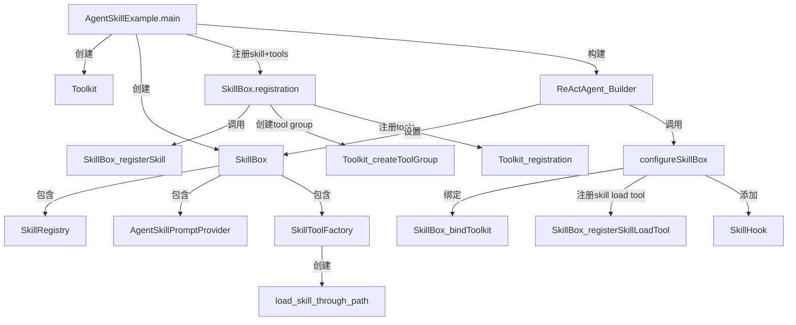
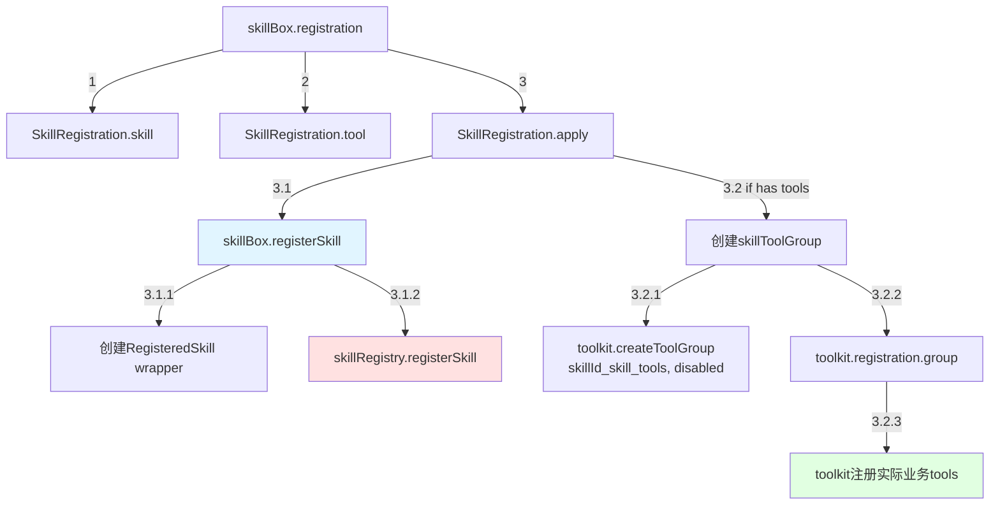
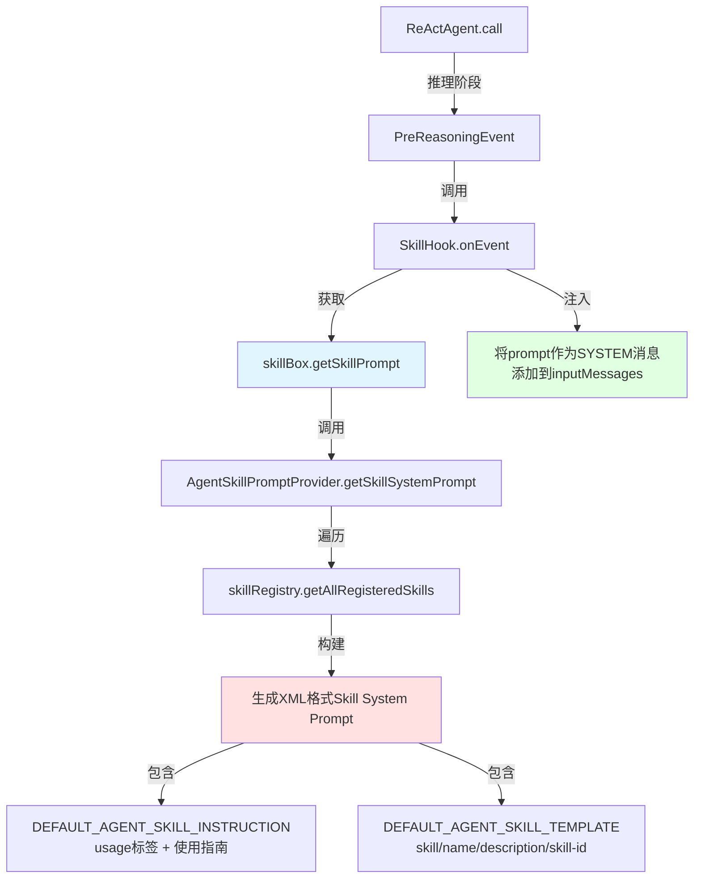
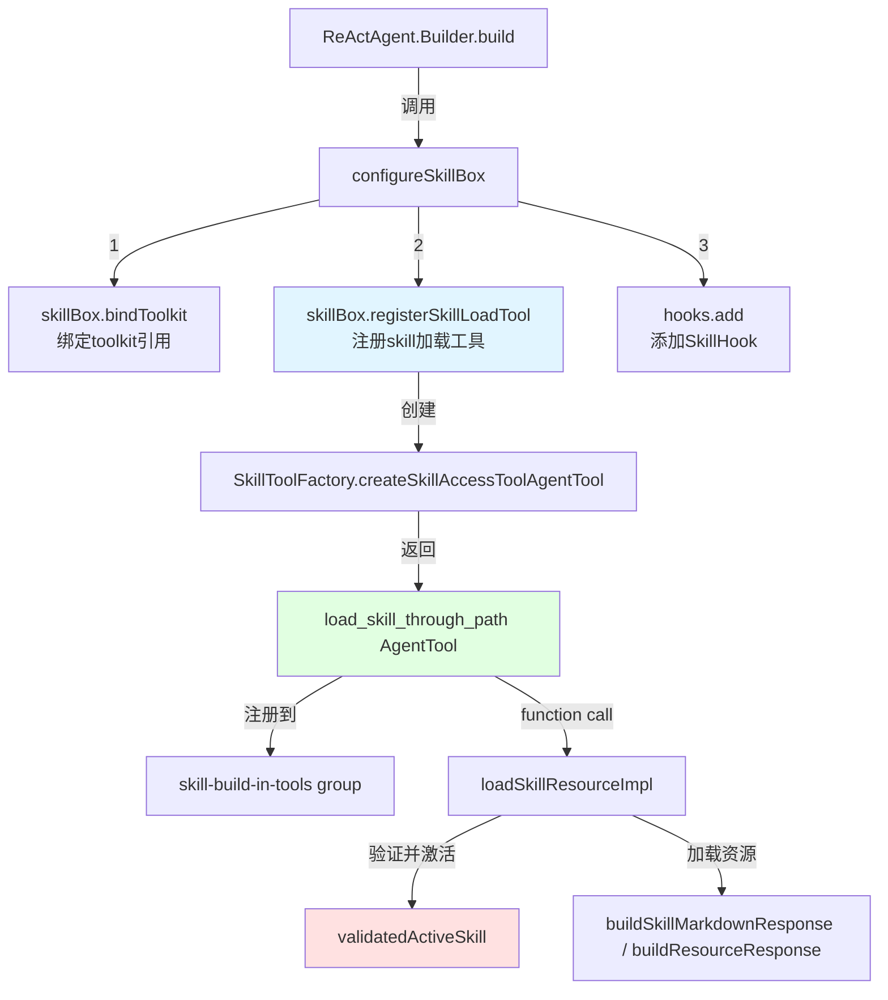
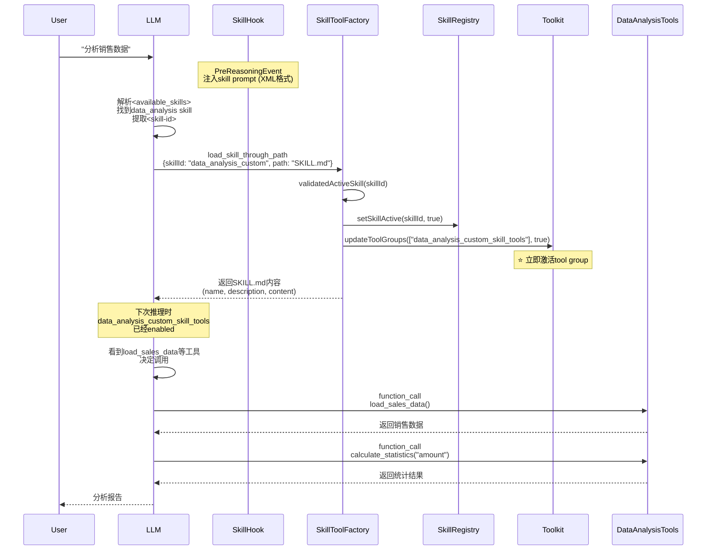

# AgentScope Skill System 调用树分析

> **文档版本**: v2.0  
> **更新日期**: 2026-01-26  
> **适用版本**: AgentScope-Java 当前代码库  

## 概述

本文档深入分析了AgentScope框架中Skill System的完整调用链路，包括：
1. Skill的注册流程
2. System Prompt的注入机制（基于XML结构化提示词）
3. Skill Instruction的渐进式暴露原理
4. 统一的Skill加载工具（`load_skill_through_path`）
5. 完整的调用树分析

## ⚠️ 重要变更说明

相比旧版本，Skill System已进行重大优化：

### 变更1: Skill加载工具统一化

**旧版本**: 三个独立工具
- `skill_md_load_tool`
- `skill_resources_load_tool`
- `get_all_resources_path_tool`

**新版本**: 单一工具
- `load_skill_through_path(skillId, path)` - 统一加载入口
  - 使用 `enum` 约束 `skillId`，确保安全
  - 自动返回可用资源列表（资源不存在时）
  - SKILL.md 始终作为首选资源

### 变更2: System Prompt结构优化

**旧版本**: 基于Markdown格式
```markdown
### data_analysis_custom
Use this skill when...
check "SKILL.md" for how to use this skill
```

**新版本**: 基于XML标签
```xml
<skill>
<name>data_analysis</name>
<description>Use this skill when...</description>
<skill-id>data_analysis_custom</skill-id>
</skill>
```

**优势**:
- ✅ 提升LLM解析准确性
- ✅ 明确skill-id与name的区分
- ✅ 支持结构化信息提取

### 变更3: Hook机制简化

**旧版本**: 
- `PreCallEvent`: deactivateAllSkills + syncToolGroupStates
- `PreReasoningEvent`: syncToolGroupStates + 注入prompt
- `PostCallEvent`: deactivateAllSkills + syncToolGroupStates

**新版本**:
- 仅 `PreReasoningEvent`: 注入skill prompt (XML格式)
- Tool Group状态由 `load_skill_through_path` 直接管理
- 移除不必要的状态重置逻辑

---

## 一、核心组件架构

### 1.1 核心类关系



### 1.2 关键类说明

- **`SkillBox`**: Skill管理容器，负责skill的注册、激活状态管理、prompt生成、代码执行环境配置
- **`SkillRegistry`**: Skill注册表，存储所有已注册的skill及其激活状态
- **`AgentSkillPromptProvider`**: 生成skill的system prompt（基于XML结构化模板）
- **`SkillToolFactory`**: 工厂类，创建skill加载工具（`load_skill_through_path`）
- **`SkillHook`**: Hook机制，负责在推理前（`PreReasoningEvent`）注入skill prompt
- **`AgentSkill`**: Skill数据对象，包含skillId, name, description, content, resources, source

---

## 二、Skill注册流程详细分析

### 2.1 注册流程调用树



### 2.2 代码示例（来自AgentSkillExample.java）

```java
// 步骤1: 创建Toolkit和SkillBox
Toolkit toolkit = new Toolkit();
SkillBox skillBox = new SkillBox(toolkit);

// 步骤2: 创建skill对象（包含name, description, content, resources）
AgentSkill dataSkill = createDataAnalysisSkill();
// dataSkill.getName() = "data_analysis"
// dataSkill.getSkillId() = "data_analysis_custom" (自动生成: name + "_" + source)
// dataSkill.getDescription() = "Use this skill when you need to analyze sales data..."
// dataSkill.getSkillContent() = markdown内容
// dataSkill.getResources() = Map<String, String> 包含参考资源

// 步骤3: 注册skill及其关联的tools
skillBox.registration()
    .skill(dataSkill)  // 注册skill元数据
    .tool(new DataAnalysisTools())  // 注册实际业务工具类
    .apply();

// 内部流程:
// 3.1 skillBox.registerSkill(dataSkill)
//     - 创建RegisteredSkill包装器
//     - 存储到skillRegistry
// 3.2 创建tool group: "data_analysis_custom_skill_tools" (默认disabled)
// 3.3 将DataAnalysisTools的@Tool方法注册到该group
//     - load_sales_data
//     - calculate_statistics
//     - analyze_trend
//     - generate_chart
//     - create_report
```

### 2.3 Tool Group的作用

每个skill都有一个独立的tool group（`{skillId}_skill_tools`），初始状态为**disabled**：

- **目的**: 实现渐进式暴露（Progressive Disclosure）
- **激活机制**: 当LLM调用`load_skill_through_path`加载skill后，对应的tool group立即被激活
- **性能优化**: 避免将所有tools一次性暴露给LLM，减少token消耗

---

## 三、System Prompt注入机制

### 3.1 Prompt注入调用树（新版本简化）



### 3.2 System Prompt内容详解

#### 3.2.1 Skill Instruction（渐进式暴露指南）

```java
public static final String DEFAULT_AGENT_SKILL_INSTRUCTION =
    """
    ## Available Skills

    <usage>
    When you need to perform tasks, check if any of the available skills below can help complete the task more effectively. Skills provide specialized capabilities, tools, and domain knowledge.

    How to use skills:
    - Load skill: load_skill_through_path(skillId="<skill-id>", path="SKILL.md")
    - The skill will be activated and its documentation loaded with detailed instructions
    - Additional resources (scripts, assets, references) can be loaded using the same tool with different paths

    Usage notes:
    - Only use skills listed in <available_skills> below
    - Loading SKILL.md activates the skill and will make its tools available

    Template fields explanation:
    - <name>: The skill's display name. Use it along with <description> to determine if this skill is relevant to your current task
    - <description>: Detailed description of when and how to use this skill. Read carefully to decide whether to load this skill
    - <skill-id>: The unique identifier used to load the skill via load_skill_through_path tool
    </usage>

    <available_skills>

    """;
```

**关键点**:
- ✅ **如果不注册skill，此instruction不会被注入**
- ✅ 使用XML标签 `<usage>` 和 `<available_skills>` 组织信息
- ✅ 统一使用 `load_skill_through_path` 工具
- ✅ 明确 `<skill-id>` 用于工具调用，`<name>` 用于理解
- ✅ 强调"按需加载"（on-demand）原则

#### 3.2.2 Skill Template（基于XML结构化模板）

```java
// skillName, skillDescription, skillId
public static final String DEFAULT_AGENT_SKILL_TEMPLATE =
    """
    <skill>
    <name>%s</name>
    <description>%s</description>
    <skill-id>%s</skill-id>
    </skill>

    """;
```

生成的实际prompt（以data_analysis skill为例）:

```xml
<skill>
<name>data_analysis</name>
<description>Use this skill when you need to analyze sales data, calculate statistics, identify trends, or generate reports. This skill provides comprehensive data analysis capabilities.</description>
<skill-id>data_analysis_custom</skill-id>
</skill>
```

**三元组结构**:
- `%s[1]` = `skill.getName()` → "data_analysis" (显示名称)
- `%s[2]` = `skill.getDescription()` → 完整的使用场景描述
- `%s[3]` = `skill.getSkillId()` → "data_analysis_custom" (用于工具调用的唯一ID)

### 3.3 完整的System Prompt示例

```xml
## Available Skills

<usage>
When you need to perform tasks, check if any of the available skills below can help complete the task more effectively. Skills provide specialized capabilities, tools, and domain knowledge.

How to use skills:
- Load skill: load_skill_through_path(skillId="<skill-id>", path="SKILL.md")
- The skill will be activated and its documentation loaded with detailed instructions
- Additional resources (scripts, assets, references) can be loaded using the same tool with different paths

Usage notes:
- Only use skills listed in <available_skills> below
- Loading SKILL.md activates the skill and will make its tools available

Template fields explanation:
- <name>: The skill's display name. Use it along with <description> to determine if this skill is relevant to your current task
- <description>: Detailed description of when and how to use this skill. Read carefully to decide whether to load this skill
- <skill-id>: The unique identifier used to load the skill via load_skill_through_path tool
</usage>

<available_skills>

<skill>
<name>data_analysis</name>
<description>Use this skill when you need to analyze sales data, calculate statistics, identify trends, or generate reports. This skill provides comprehensive data analysis capabilities.</description>
<skill-id>data_analysis_custom</skill-id>
</skill>

</available_skills>
```

---

## 四、统一Skill加载工具实现

### 4.1 load_skill_through_path 注册流程



### 4.2 load_skill_through_path 详细实现

#### 4.2.1 工具定义

```java
AgentTool createSkillAccessToolAgentTool() {
    return new AgentTool() {
        @Override
        public String getName() {
            return "load_skill_through_path";
        }

        @Override
        public String getDescription() {
            return "Load and activate a skill resource by its ID and resource path.\n\n"
                    + "**Functionality:**\n"
                    + "1. Activates the specified skill (making its tools available)\n"
                    + "2. Returns the requested resource content\n"
                    + "- 'SKILL.md': The skill's markdown documentation\n"
                    + "- Other paths: Additional resources like scripts, configs, templates";
        }

        @Override
        public Map<String, Object> getParameters() {
            // 获取所有可用的skillId
            List<String> availableSkillIds = 
                new ArrayList<>(skillRegistry.getAllRegisteredSkills().keySet());
            
            return Map.of(
                "type", "object",
                "properties", Map.of(
                    "skillId", Map.of(
                        "type", "string",
                        "description", "The unique identifier of the skill.",
                        "enum", availableSkillIds  // ⭐ 使用enum约束，确保安全
                    ),
                    "path", Map.of(
                        "type", "string",
                        "description", "The path to the resource file within the skill (e.g., 'SKILL.md', 'references/api.md')"
                    )
                ),
                "required", List.of("skillId", "path")
            );
        }

        @Override
        public Mono<ToolResultBlock> callAsync(ToolCallParam param) {
            String skillId = (String) param.getInput().get("skillId");
            String path = (String) param.getInput().get("path");
            String result = loadSkillResourceImpl(skillId, path);
            return Mono.just(ToolResultBlock.text(result));
        }
    };
}
```

#### 4.2.2 加载实现逻辑

```java
private String loadSkillResourceImpl(String skillId, String path) {
    // 1. 验证并激活skill（关键步骤）⭐
    AgentSkill skill = validatedActiveSkill(skillId);
    
    // 2. 特殊处理SKILL.md
    if ("SKILL.md".equals(path)) {
        return buildSkillMarkdownResponse(skillId, skill);
    }
    
    // 3. 加载其他资源
    Map<String, String> resources = skill.getResources();
    if (resources == null || !resources.containsKey(path)) {
        // ⭐ 资源不存在，返回可用资源列表
        throw new IllegalArgumentException(
            buildResourceNotFoundMessage(skillId, path, resources)
        );
    }
    
    return buildResourceResponse(skillId, path, resources.get(path));
}

private AgentSkill validatedActiveSkill(String skillId) {
    // 验证skill存在
    if (!skillRegistry.exists(skillId)) {
        throw new IllegalArgumentException("Skill not found: " + skillId);
    }
    
    // 获取skill
    AgentSkill skill = skillRegistry.getSkill(skillId);
    
    // ⭐ 激活skill
    skillRegistry.setSkillActive(skillId, true);
    logger.info("Activated skill: {}", skillId);
    
    // ⭐ 立即激活对应的tool group（无需等待下次推理）
    String toolsGroupName = skillRegistry.getRegisteredSkill(skillId).getToolsGroupName();
    if (toolkit.getToolGroup(toolsGroupName) != null) {
        toolkit.updateToolGroups(List.of(toolsGroupName), true);
        logger.info("Activated skill tool group: {} and its tools: {}",
            toolsGroupName, toolkit.getToolGroup(toolsGroupName).getTools());
    }
    
    return skill;
}
```

#### 4.2.3 智能提示机制

```java
private String buildResourceNotFoundMessage(String skillId, String path, Map<String, String> resources) {
    StringBuilder message = new StringBuilder();
    message.append("Resource not found: '").append(path).append("' in skill '").append(skillId).append("'.\n\n");
    
    // ⭐ 构建可用资源列表，SKILL.md始终作为首选
    List<String> resourcePaths = new ArrayList<>();
    resourcePaths.add("SKILL.md");  // Always add SKILL.md as the first resource
    
    if (resources != null && !resources.isEmpty()) {
        resourcePaths.addAll(resources.keySet());
    }
    
    message.append("Available resources:\n");
    for (int i = 0; i < resourcePaths.size(); i++) {
        message.append(i + 1).append(". ").append(resourcePaths.get(i)).append("\n");
    }
    
    return message.toString();
}
```

**关键机制**:
- ✅ **统一入口**: 单一工具处理所有资源加载
- ✅ **enum约束**: `skillId`参数使用enum限制可选值，防止无效调用
- ✅ **即时激活**: 加载时立即激活skill和tool group（无需等待下次推理）
- ✅ **智能提示**: 资源不存在时自动返回可用资源列表
- ✅ **SKILL.md优先**: 始终将SKILL.md作为首选资源

---

## 五、完整调用流程分析

### 5.1 启动阶段

```
AgentSkillExample.main()
├── [1] 创建Toolkit对象
│   └── new Toolkit()
│
├── [2] 创建SkillBox对象  
│   └── new SkillBox(toolkit)
│       ├── skillRegistry = new SkillRegistry()
│       ├── skillPromptProvider = new AgentSkillPromptProvider(skillRegistry)
│       └── skillToolFactory = new SkillToolFactory(skillRegistry, toolkit)
│
├── [3] 注册Skill和Tools
│   └── setupDataAnalysisSkills(toolkit, skillBox)
│       ├── createDataAnalysisSkill()
│       │   └── 创建AgentSkill对象（通过SkillUtil.createFrom）
│       │       ├── name: "data_analysis"
│       │       ├── skillId: "data_analysis_custom" (name + "_" + source)
│       │       ├── description: "Use this skill when..."
│       │       ├── skillContent: markdown文档
│       │       ├── resources: Map<String, String>
│       │       └── source: "custom"
│       │
│       └── skillBox.registration()
│           ├── .skill(dataSkill)
│           ├── .tool(new DataAnalysisTools())
│           └── .apply()
│               ├── [3.1] skillBox.registerSkill(dataSkill)
│               │   ├── new RegisteredSkill(skillId)
│               │   └── skillRegistry.registerSkill(skillId, skill, registered)
│               │
│               └── [3.2] if (has tools)
│                   ├── skillToolGroup = "data_analysis_custom_skill_tools"
│                   ├── toolkit.createToolGroup(skillToolGroup, disabled=false)
│                   └── toolkit.registration()
│                       .group(skillToolGroup)
│                       .tool(new DataAnalysisTools())
│                       .apply()
│                           ├── 扫描@Tool方法
│                           └── 注册5个tools到该group
│                               ├── load_sales_data
│                               ├── calculate_statistics
│                               ├── analyze_trend
│                               ├── generate_chart
│                               └── create_report
│
└── [4] 构建ReActAgent
    └── ReActAgent.builder()
        ├── .toolkit(toolkit)
        ├── .skillBox(skillBox)
        └── .build()
            └── configureSkillBox()
                ├── [4.1] skillBox.bindToolkit(toolkit)
                ├── [4.2] skillBox.registerSkillLoadTool()
                │   ├── 创建SkillToolFactory
                │   ├── 生成load_skill_through_path AgentTool
                │   └── 注册到skill-build-in-tools group
                │
                └── [4.3] hooks.add(new SkillHook(skillBox))
```

### 5.2 运行时阶段（单轮对话）

```
agent.call(userMsg)
│
├── [Reasoning Phase 1]
│   ├── [Hook: PreReasoningEvent]
│   │   └── SkillHook.onEvent(PreReasoningEvent)
│   │       └── 注入Skill System Prompt (XML格式)
│   │           ├── skillBox.getSkillPrompt()
│   │           │   └── AgentSkillPromptProvider.getSkillSystemPrompt()
│   │           │       ├── 添加DEFAULT_AGENT_SKILL_INSTRUCTION
│   │           │       │   └── 包含<usage>和<available_skills>标签
│   │           │       ├── 遍历skillRegistry.getAllRegisteredSkills()
│   │           │       └── foreach skill:
│   │           │           └── format(TEMPLATE, name, description, skillId)
│   │           │               └── 生成<skill>...</skill> XML块
│   │           │
│   │           └── inputMessages.add(Msg[SYSTEM, skillPrompt])
│   │
│   ├── [LLM Reasoning]
│   │   └── 模型解析XML，看到<skill-id>data_analysis_custom</skill-id>
│   │       └── 决定调用load_skill_through_path
│   │
│   └── [Acting Phase]
│       └── LLM调用: load_skill_through_path(
│           skillId="data_analysis_custom", path="SKILL.md")
│           └── SkillToolFactory.loadSkillResourceImpl(skillId, path)
│               ├── [1] validatedActiveSkill(skillId)
│               │   ├── skillRegistry.exists(skillId) → true
│               │   ├── skillRegistry.setSkillActive(skillId, true) ⭐
│               │   ├── toolkit.updateToolGroups(["data_analysis_custom_skill_tools"], true) ⭐
│               │   │   └── 立即激活tool group（无需等待下次推理）
│               │   └── return skill
│               │
│               ├── [2] path.equals("SKILL.md") → true
│               └── [3] return buildSkillMarkdownResponse(skillId, skill)
│                       └── 包含name, description, source, content
│
├── [Reasoning Phase 2]
│   ├── [Hook: PreReasoningEvent]
│   │   └── SkillHook.onEvent(PreReasoningEvent)
│   │       └── 注入Skill System Prompt（同上）
│   │
│   ├── [LLM看到可用tools]
│   │   └── data_analysis_custom_skill_tools已激活
│   │       ├── load_sales_data
│   │       ├── calculate_statistics
│   │       ├── analyze_trend
│   │       ├── generate_chart
│   │       └── create_report
│   │
│   └── [Acting Phase]
│       └── LLM调用: load_sales_data()
│           └── DataAnalysisTools.loadSalesData()
│               └── return "Sales Data Loaded..."
│
└── [继续后续推理和工具调用...]
```

### 5.3 完整序列图



---

## 六、关键设计模式总结

### 6.1 渐进式暴露（Progressive Disclosure）

**实现方式**:
1. **初始状态**: 使用XML格式暴露skill的三元组（name, description, skill-id）
2. **按需加载**: LLM调用`load_skill_through_path`获取详细文档或资源
3. **即时激活**: 加载时立即激活skill和tool group（无需等待下次推理）
4. **智能提示**: 资源不存在时自动返回可用资源列表

**优势**:
- ✅ 减少LLM的token消耗
- ✅ 提高模型决策效率（XML结构化提示词）
- ✅ 避免工具过载（tool overload）
- ✅ 增强安全性（enum约束skillId）
- ✅ 简化流程（移除复杂的状态同步逻辑）

### 6.2 Hook机制简化

**新版本Hook事件**:
- `PreReasoningEvent`: 仅注入skill prompt（XML格式）

**移除的逻辑**:
- ~~`PreCallEvent`~~: 不再需要预先重置状态
- ~~`PostCallEvent`~~: 不再需要事后清理状态
- ~~`syncToolGroupStates()`~~: Tool Group由加载工具直接管理

**优势**:
- ✅ 简化Hook逻辑，减少不必要的状态管理
- ✅ 状态变更即时生效，无需等待下次推理
- ✅ 解耦skill管理逻辑和agent核心逻辑

### 6.3 Tool Group机制

**作用**:
- 将skill相关的tools组织到独立的group
- 支持动态启用/禁用整组tools
- 实现细粒度的工具访问控制

**激活时机**:
- 初始状态: disabled
- 激活: 调用`load_skill_through_path`时立即激活
- 持久性: 一旦激活，在整个会话期间保持激活状态

---

## 七、最佳实践建议

### 7.1 Skill定义

```java
// 使用SkillUtil.createFrom从Markdown创建
String skillMd = """
---
name: data_analysis
description: Use this skill when you need to analyze sales data, calculate statistics, identify trends, or generate reports.
---

# Data Analysis Skill

## Overview
...

## Available Tools
1. **load_sales_data**: ...
2. **calculate_statistics**: ...

## Workflow
1. Load data
2. Calculate statistics
3. Generate report
""";

Map<String, String> resources = Map.of(
    "references/statistics-guide.md", "...",
    "examples/sample-analysis.md", "..."
);

AgentSkill skill = SkillUtil.createFrom(skillMd, resources);
```

### 7.2 注册流程

```java
// 1. 创建skill
AgentSkill skill = SkillUtil.createFrom(skillMd, resources);

// 2. 注册skill和tools（fluent API）
skillBox.registration()
    .skill(skill)
    .tool(new YourToolsClass())  // 实际业务工具
    .apply();

// 3. 在agent builder中配置
ReActAgent agent = ReActAgent.builder()
    .toolkit(toolkit)
    .skillBox(skillBox)  // 自动注册skill load tool和hook
    .build();
```

### 7.3 System Prompt设计原则

- **Description要清晰**: 让LLM知道何时使用该skill
- **Content要结构化**: 使用markdown格式，包含Overview、Tools、Workflow等章节
- **Resources要精准**: 提供有价值的补充信息，避免冗余
- **name和skillId区分**: name用于显示，skillId用于工具调用

---

## 八、常见问题FAQ

### Q1: 为什么skill的tool group初始状态是disabled？

**A**: 这是渐进式暴露的核心机制。只有当LLM明确需要某个skill时（通过调用`load_skill_through_path`），相关的工具才会被激活，避免工具过载。

### Q2: Skill Instruction什么时候会被注入？

**A**: 只有在`skillBox`中注册了至少一个skill时，`DEFAULT_AGENT_SKILL_INSTRUCTION`才会被注入到system prompt中。如果没有注册任何skill，这段instruction不会出现。

### Q3: 为什么使用enum约束skillId参数？

**A**: 在`load_skill_through_path`的JSON Schema中，`skillId`参数使用`enum`字段限制可选值为已注册的skillId列表。好处是：
1. **安全性**: 防止LLM尝试加载不存在的skill（防御注入攻击）
2. **准确性**: 引导LLM从有效选项中选择，减少错误
3. **自动补全**: 部分LLM会利用enum提供更好的工具调用建议

### Q4: 新旧版本的Tool Group激活机制有什么区别？

**A**: 
- **旧版本**: 在`PreReasoningEvent`中通过`syncToolGroupStates()`同步状态，加载skill后需要等到下次推理才能使用tools
- **新版本**: 在`load_skill_through_path`执行时立即激活tool group，加载后下次推理即可使用tools，无需额外的同步步骤

### Q5: 如何确保skill状态在多轮对话中的一致性？

**A**: 新版本采用"激活后持久化"策略：
- 一旦skill被`load_skill_through_path`激活，在整个会话期间保持激活状态
- 不再在每次call前后重置状态
- 如需重置，可以在新会话开始时调用`skillBox.deactivateAllSkills()`

---

## 九、总结

AgentScope的Skill System通过以下机制实现了高效的技能管理：

1. **XML结构化Prompt**: 基于(name, description, skill-id)三元组生成清晰的skill介绍
2. **渐进式暴露**: 初始只暴露skill元信息，按需加载详细文档和资源
3. **统一加载工具**: 通过`load_skill_through_path`实现所有资源的加载和激活
4. **即时激活机制**: 加载skill时立即激活对应的tool group，无需等待下次推理
5. **安全约束**: 使用enum约束skillId参数，防止无效调用
6. **智能提示**: 资源不存在时自动返回可用资源列表
7. **Hook简化**: 仅在推理前注入prompt，移除复杂的状态同步逻辑
8. **Tool Group隔离**: 每个skill的工具独立管理，支持动态启用/禁用

这种设计兼顾了**灵活性**（支持复杂的skill组合）、**性能**（减少token消耗）、**安全性**（enum约束）和**易用性**（统一接口，自动化流程）。

---

**文档版本**: v2.0  
**文档生成时间**: 2026-01-26  
**AgentScope版本**: 基于当前代码库分析  
**作者**: AI Assistant (Qoder)

## 附录：版本变更历史

### v2.0 (2026-01-26)
- ✅ 统一Skill加载工具为`load_skill_through_path`
- ✅ 使用XML结构化Prompt提升LLM解析准确性
- ✅ 简化Hook机制，移除不必要的状态同步
- ✅ 实现即时激活机制，无需等待下次推理
- ✅ 添加enum约束提升安全性
- ✅ 完善智能提示功能

### v1.0 (2025-12-30)
- 初始版本，使用三个独立的skill加载工具
- 使用Markdown格式的Prompt模板
- 复杂的状态同步逻辑
