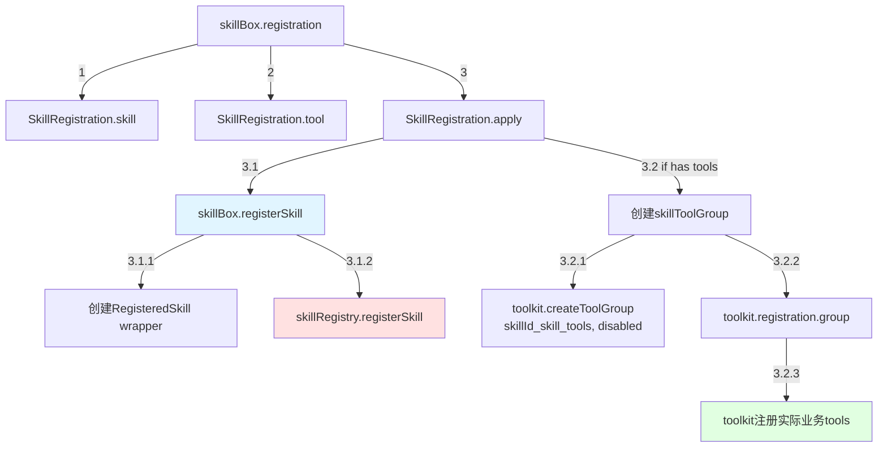
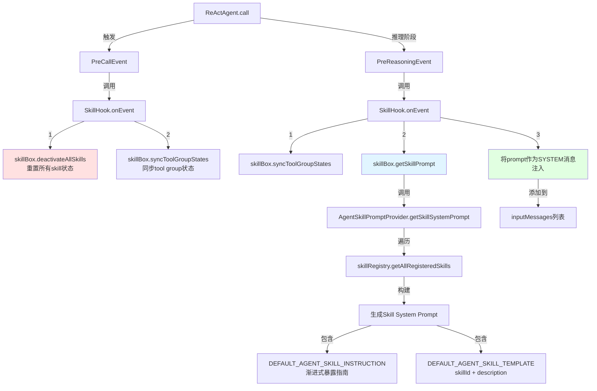
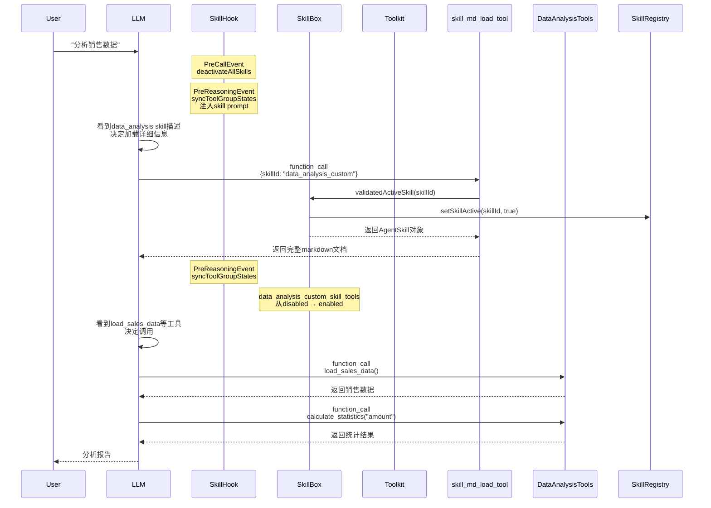

# AgentScope Skill System 调用树分析

## 概述

本文档深入分析了AgentScope框架中Skill System的完整调用链路，包括：
1. Skill的注册流程
2. System Prompt的注入机制（基于name+description二元组）
3. Skill Instruction的渐进式暴露原理
4. Function Call实现机制
5. 完整的调用树分析

---

## 一、核心组件架构

### 1.1 核心类关系

```mermaid
graph TB
    AgentSkillExample[AgentSkillExample.main] -->|创建| Toolkit
    AgentSkillExample -->|创建| SkillBox
    AgentSkillExample -->|注册skill+tools| SkillBox_registration[SkillBox.registration]
    SkillBox_registration -->|调用| SkillBox_registerSkill
    SkillBox_registration -->|创建tool group| Toolkit_createToolGroup
    SkillBox_registration -->|注册tools| Toolkit_registration
    
    AgentSkillExample -->|构建| ReActAgent_Builder
    ReActAgent_Builder -->|设置| SkillBox
    ReActAgent_Builder -->|调用| configureSkillBox
    
    configureSkillBox -->|绑定| SkillBox_bindToolkit
    configureSkillBox -->|注册skill load tools| Toolkit_registerTool
    configureSkillBox -->|添加| SkillHook
    
    SkillBox -->|包含| SkillRegistry
    SkillBox -->|包含| AgentSkillPromptProvider
    SkillBox -->|实现@Tool methods| skill_load_tools[skill_md_load_tool<br/>skill_resources_load_tool<br/>get_all_resources_path_tool]
```

### 1.2 关键类说明

- **`SkillBox`**: Skill管理容器，负责skill的注册、激活状态管理、prompt生成
- **`SkillRegistry`**: Skill注册表，存储所有已注册的skill
- **`AgentSkillPromptProvider`**: 生成skill的system prompt
- **`SkillHook`**: Hook机制，负责在推理前注入skill prompt和同步tool group状态
- **`AgentSkill`**: Skill数据对象，包含skillId, name, description, content, resources

---

## 二、Skill注册流程详细分析

### 2.1 注册流程调用树



### 2.2 代码示例（来自AgentSkillExample.java）

```java
// 步骤1: 创建Toolkit和SkillBox
Toolkit toolkit = new Toolkit();
SkillBox skillBox = new SkillBox(toolkit);

// 步骤2: 创建skill对象（包含name, description, content, resources）
AgentSkill dataSkill = createDataAnalysisSkill();
// dataSkill.getName() = "data_analysis"
// dataSkill.getDescription() = "Use this skill when you need to analyze sales data..."
// dataSkill.getSkillContent() = markdown内容
// dataSkill.getResources() = Map<String, String> 包含参考资源

// 步骤3: 注册skill及其关联的tools
skillBox.registration()
    .skill(dataSkill)  // 注册skill元数据
    .tool(new DataAnalysisTools())  // 注册实际业务工具类
    .apply();

// 内部流程:
// 3.1 skillBox.registerSkill(dataSkill)
//     - 创建RegisteredSkill包装器
//     - 存储到skillRegistry
// 3.2 创建tool group: "data_analysis_custom_skill_tools" (默认disabled)
// 3.3 将DataAnalysisTools的@Tool方法注册到该group
//     - load_sales_data
//     - calculate_statistics
//     - analyze_trend
//     - generate_chart
//     - create_report
```

### 2.3 Tool Group的作用

每个skill都有一个独立的tool group（`{skillId}_skill_tools`），初始状态为**disabled**：

- **目的**: 实现渐进式暴露（Progressive Disclosure）
- **激活机制**: 只有当LLM调用`skill_md_load_tool`加载skill后，对应的tool group才会被激活
- **性能优化**: 避免将所有tools一次性暴露给LLM，减少token消耗

---

## 三、System Prompt注入机制

### 3.1 Prompt注入调用树



### 3.2 System Prompt内容详解

#### 3.2.1 Skill Instruction（渐进式暴露指南）

```java
public static final String DEFAULT_AGENT_SKILL_INSTRUCTION =
    "# Agent Skills\n"
    + "Agent skills are specialized capabilities you can load on-demand to handle"
    + " specific tasks. Each skill below includes a brief description. When you need to"
    + " use a skill:\n"
    + "1. Use `skill_md_load_tool` with the skillId to read its detailed SKILL.md"
    + " documentation\n"
    + "2. If the skill requires additional resources, use `get_all_resources_path_tool`"
    + " to see what's available\n"
    + "3. Load specific resources with `skill_resources_load_tool` as needed\n\n"
    + "Only load skill details when you actually need them for the current task.\n\n"
    + "## Available Skills\n";
```

**关键点**:
- ✅ **如果不注册skill，此instruction不会被注入**
- ✅ 指导LLM使用skill load tools来获取详细信息
- ✅ 强调"按需加载"（on-demand）原则

#### 3.2.2 Skill Template（基于name+description二元组）

```java
public static final String DEFAULT_AGENT_SKILL_TEMPLATE =
    """
    ### %s
    %s
    check "SKILL.md" for how to use this skill
    """;
```

生成的实际prompt（以data_analysis skill为例）:

```
### data_analysis_custom
Use this skill when you need to analyze sales data, calculate statistics, identify trends, or generate reports. This skill provides comprehensive data analysis capabilities.
check "SKILL.md" for how to use this skill
```

**二元组结构**:
- `%s[1]` = `skill.getSkillId()` → "data_analysis_custom"
- `%s[2]` = `skill.getDescription()` → 完整的使用场景描述

### 3.3 完整的System Prompt示例

```
# Agent Skills
Agent skills are specialized capabilities you can load on-demand to handle specific tasks. Each skill below includes a brief description. When you need to use a skill:
1. Use `skill_md_load_tool` with the skillId to read its detailed SKILL.md documentation
2. If the skill requires additional resources, use `get_all_resources_path_tool` to see what's available
3. Load specific resources with `skill_resources_load_tool` as needed

Only load skill details when you actually need them for the current task.

## Available Skills

### data_analysis_custom
Use this skill when you need to analyze sales data, calculate statistics, identify trends, or generate reports. This skill provides comprehensive data analysis capabilities.
check "SKILL.md" for how to use this skill
```

---

## 四、Function Call实现机制

### 4.1 Skill Load Tools注册流程

```mermaid
graph TD
    A[ReActAgent.Builder.build] -->|调用| B[configureSkillBox]
    B -->|1| C[skillBox.bindToolkit<br/>绑定toolkit引用]
    B -->|2| D[toolkit.registerTool<br/>注册SkillBox本身]
    B -->|3| E[hooks.add<br/>添加SkillHook]
    
    D -->|扫描| F[SkillBox中的@Tool方法]
    F -->|注册| G[skill_md_load_tool]
    F -->|注册| H[skill_resources_load_tool]
    F -->|注册| I[get_all_resources_path_tool]
    
    G -->|function call| J[loadSkillMd]
    H -->|function call| K[loadSkillResource]
    I -->|function call| L[getAllResourcesPath]
    
    style D fill:#e1f5ff
    style G fill:#e1ffe1
    style H fill:#e1ffe1
    style I fill:#e1ffe1
```

### 4.2 Skill Load Tools详解

#### 4.2.1 skill_md_load_tool

```java
@Tool(
    name = "skill_md_load_tool",
    description = "Load the markdown content of a skill by its ID. "
                + "This will activate the skill and return its full content including "
                + "name, description, and implementation details.")
public Mono<ToolResultBlock> loadSkillMd(
    @ToolParam(name = "skillId", 
               description = "The unique identifier of the skill to load.")
    String skillId) {
    
    // 1. 验证skillId
    if (!skillRegistry.exists(skillId)) {
        throw new IllegalArgumentException(...);
    }
    
    // 2. ⭐激活skill（关键步骤）
    skillRegistry.setSkillActive(skillId, true);
    
    // 3. 获取skill对象
    AgentSkill skill = skillRegistry.getSkill(skillId);
    
    // 4. 返回完整的markdown内容
    return ToolResultBlock.text(
        "Name: " + skill.getName() + "\n" +
        "Description: " + skill.getDescription() + "\n" +
        "Content:\n" + skill.getSkillContent()
    );
}
```

**关键机制**:
- ✅ **激活skill**: `skillRegistry.setSkillActive(skillId, true)`
- ✅ **触发tool group激活**: 下次`syncToolGroupStates()`时会启用对应的tool group
- ✅ **返回详细文档**: 包含skill的完整markdown内容

#### 4.2.2 Tool Group激活机制

```java
// SkillHook.onEvent (PreReasoningEvent)
public <T extends HookEvent> Mono<T> onEvent(T event) {
    if (event instanceof PreReasoningEvent) {
        // 同步tool group状态
        skillBox.syncToolGroupStates();
        // ... 注入skill prompt
    }
}

// SkillBox.syncToolGroupStates
public void syncToolGroupStates() {
    List<String> activeSkillToolGroups = new ArrayList<>();
    List<String> inactiveSkillToolGroups = new ArrayList<>();
    
    for (RegisteredSkill registeredSkill : skillRegistry.getAllRegisteredSkills().values()) {
        if (registeredSkill.isActive()) {
            activeSkillToolGroups.add(registeredSkill.getToolsGroupName());
        } else {
            inactiveSkillToolGroups.add(registeredSkill.getToolsGroupName());
        }
    }
    
    // 更新toolkit中的tool group状态
    toolkit.updateToolGroups(inactiveSkillToolGroups, false);  // 禁用
    toolkit.updateToolGroups(activeSkillToolGroups, true);     // 启用
}
```

### 4.3 完整的Function Call流程



---

## 五、完整调用树（深度分析）

### 5.1 启动阶段

```
AgentSkillExample.main()
├── [1] 创建Toolkit对象
│   └── new Toolkit()
│
├── [2] 创建SkillBox对象  
│   └── new SkillBox(toolkit)
│       ├── skillRegistry = new SkillRegistry()
│       └── skillPromptProvider = new AgentSkillPromptProvider(skillRegistry)
│
├── [3] 注册Skill和Tools
│   └── setupDataAnalysisSkills(toolkit, skillBox)
│       ├── createDataAnalysisSkill()
│       │   └── 创建AgentSkill对象
│       │       ├── skillId: "data_analysis_custom"
│       │       ├── name: "data_analysis"
│       │       ├── description: "Use this skill when..."
│       │       ├── skillContent: markdown文档
│       │       └── resources: Map<String, String>
│       │
│       └── skillBox.registration()
│           ├── .skill(dataSkill)
│           ├── .tool(new DataAnalysisTools())
│           └── .apply()
│               ├── [3.1] skillBox.registerSkill(dataSkill)
│               │   ├── new RegisteredSkill(skillId)
│               │   └── skillRegistry.registerSkill(skillId, skill, registered)
│               │
│               └── [3.2] if (has tools)
│                   ├── skillToolGroup = "data_analysis_custom_skill_tools"
│                   ├── toolkit.createToolGroup(skillToolGroup, disabled=true)
│                   └── toolkit.registration()
│                       .group(skillToolGroup)
│                       .tool(new DataAnalysisTools())
│                       .apply()
│                           ├── 扫描@Tool方法
│                           └── 注册5个tools到该group
│                               ├── load_sales_data
│                               ├── calculate_statistics
│                               ├── analyze_trend
│                               ├── generate_chart
│                               └── create_report
│
└── [4] 构建ReActAgent
    └── ReActAgent.builder()
        ├── .toolkit(toolkit)
        ├── .skillBox(skillBox)
        └── .build()
            └── configureSkillBox()
                ├── [4.1] skillBox.bindToolkit(toolkit)
                ├── [4.2] toolkit.registerTool(skillBox)
                │   └── 扫描SkillBox的@Tool方法
                │       ├── skill_md_load_tool
                │       ├── skill_resources_load_tool
                │       └── get_all_resources_path_tool
                │
                └── [4.3] hooks.add(new SkillHook(skillBox))
```

### 5.2 运行时阶段（单轮对话）

```
agent.call(userMsg)
│
├── [Hook: PreCallEvent]
│   └── SkillHook.onEvent(PreCallEvent)
│       ├── skillBox.deactivateAllSkills()
│       │   └── skillRegistry.setAllSkillsActive(false)
│       │       └── 所有RegisteredSkill.active = false
│       │
│       └── skillBox.syncToolGroupStates()
│           └── toolkit.updateToolGroups(allSkillToolGroups, disabled=true)
│
├── [Reasoning Phase 1]
│   ├── [Hook: PreReasoningEvent]
│   │   └── SkillHook.onEvent(PreReasoningEvent)
│   │       ├── [1] skillBox.syncToolGroupStates()
│   │       │   └── 因为所有skill都未激活，所有tool group保持disabled
│   │       │
│   │       └── [2] 注入Skill System Prompt
│   │           ├── skillBox.getSkillPrompt()
│   │           │   └── AgentSkillPromptProvider.getSkillSystemPrompt()
│   │           │       ├── 遍历skillRegistry.getAllRegisteredSkills()
│   │           │       └── 构建prompt
│   │           │           ├── DEFAULT_AGENT_SKILL_INSTRUCTION
│   │           │           └── foreach skill:
│   │           │               └── format(TEMPLATE, skillId, description)
│   │           │
│   │           └── inputMessages.add(Msg[SYSTEM, skillPrompt])
│   │
│   ├── [LLM Reasoning]
│   │   └── 模型看到skill描述，决定调用skill_md_load_tool
│   │
│   └── [Acting Phase]
│       └── LLM调用: skill_md_load_tool(skillId="data_analysis_custom")
│           └── SkillBox.loadSkillMd(skillId)
│               ├── [1] skillRegistry.exists(skillId) → true
│               ├── [2] skillRegistry.setSkillActive(skillId, true) ⭐
│               │   └── RegisteredSkill.active = true
│               ├── [3] skill = skillRegistry.getSkill(skillId)
│               └── [4] return ToolResultBlock.text(skill.getSkillContent())
│
├── [Reasoning Phase 2]
│   ├── [Hook: PreReasoningEvent]
│   │   └── SkillHook.onEvent(PreReasoningEvent)
│   │       ├── [1] skillBox.syncToolGroupStates()
│   │       │   ├── 检测到data_analysis_custom已激活
│   │       │   └── toolkit.updateToolGroups(["data_analysis_custom_skill_tools"], enabled=true) ⭐
│   │       │       └── 该tool group中的5个tools现在可用
│   │       │
│   │       └── [2] 注入Skill System Prompt（同上）
│   │
│   ├── [LLM Reasoning]
│   │   └── 模型看到可用的tools:
│   │       ├── load_sales_data
│   │       ├── calculate_statistics
│   │       ├── ...
│   │       └── 决定调用load_sales_data
│   │
│   └── [Acting Phase]
│       └── LLM调用: load_sales_data()
│           └── DataAnalysisTools.loadSalesData()
│               └── return "Sales Data Loaded..."
│
├── [Reasoning Phase 3]
│   └── LLM继续调用calculate_statistics, analyze_trend等
│
└── [Hook: PostCallEvent]
    └── SkillHook.onEvent(PostCallEvent)
        ├── skillBox.deactivateAllSkills()
        └── skillBox.syncToolGroupStates()
            └── 所有skill tool groups恢复disabled状态
```

---

## 六、关键设计模式总结

### 6.1 渐进式暴露（Progressive Disclosure）

**实现方式**:
1. **初始状态**: 只暴露skill的(name, description)二元组
2. **按需加载**: LLM调用`skill_md_load_tool`获取详细文档
3. **工具激活**: 调用后自动激活对应的tool group
4. **状态同步**: 通过Hook机制在每次推理前同步tool group状态

**优势**:
- ✅ 减少LLM的token消耗
- ✅ 提高模型决策效率
- ✅ 避免工具过载（tool overload）

### 6.2 Hook机制

**关键Hook事件**:
- `PreCallEvent`: 重置所有skill状态
- `PreReasoningEvent`: 注入skill prompt + 同步tool group状态
- `PostCallEvent`: 清理skill状态

**优势**:
- ✅ 自动化流程，开发者无需手动管理
- ✅ 解耦skill管理逻辑和agent核心逻辑

### 6.3 Tool Group机制

**作用**:
- 将skill相关的tools组织到独立的group
- 支持动态启用/禁用整组tools
- 实现细粒度的工具访问控制

---

## 七、最佳实践建议

### 7.1 Skill定义

```java
AgentSkill skill = new AgentSkill(
    "data_analysis",  // name: 简短语义化
    "Use this skill when you need to analyze sales data, calculate statistics...",  // description: 详细的使用场景
    """
    # Data Analysis Skill
    
    ## Overview
    ...
    
    ## Available Tools
    1. **load_sales_data**: ...
    2. **calculate_statistics**: ...
    
    ## Workflow
    1. Load data
    2. Calculate statistics
    3. Generate report
    """,  // skillContent: 完整的使用指南
    Map.of(
        "references/statistics-guide.md", "...",
        "examples/sample-analysis.md", "..."
    )  // resources: 补充参考资料
);
```

### 7.2 注册流程

```java
// 1. 创建skill
AgentSkill skill = createSkill();

// 2. 注册skill和tools（fluent API）
skillBox.registration()
    .skill(skill)
    .tool(new YourToolsClass())  // 实际业务工具
    .apply();

// 3. 在agent builder中配置
ReActAgent agent = ReActAgent.builder()
    .toolkit(toolkit)
    .skillBox(skillBox)  // 自动注册skill load tools和hook
    .build();
```

### 7.3 System Prompt设计原则

- **Description要清晰**: 让LLM知道何时使用该skill
- **Content要结构化**: 使用markdown格式，包含Overview、Tools、Workflow等章节
- **Resources要精准**: 提供有价值的补充信息，避免冗余

---

## 八、常见问题FAQ

### Q1: 为什么skill的tool group初始状态是disabled？

**A**: 这是渐进式暴露的核心机制。只有当LLM明确需要某个skill时（通过调用`skill_md_load_tool`），相关的工具才会被激活，避免工具过载。

### Q2: Skill Instruction什么时候会被注入？

**A**: 只有在`skillBox`中注册了至少一个skill时，`DEFAULT_AGENT_SKILL_INSTRUCTION`才会被注入到system prompt中。如果没有注册任何skill，这段instruction不会出现。

### Q3: 如何确保skill状态在多轮对话中正确同步？

**A**: `SkillHook`在每次call的开始（PreCallEvent）和结束（PostCallEvent）都会重置所有skill状态，确保每次对话都从干净的状态开始。在每次推理前（PreReasoningEvent），会同步tool group状态。

### Q4: 可以手动控制tool group的激活吗？

**A**: 理论上可以，但不建议。推荐让LLM通过`skill_md_load_tool`自然地激活skill，这样更符合渐进式暴露的设计理念。

---

## 九、总结

AgentScope的Skill System通过以下机制实现了高效的技能管理：

1. **二元组Prompt注入**: 基于(skillId, description)生成简洁的skill介绍
2. **渐进式暴露**: 初始只暴露skill元信息，按需加载详细文档和工具
3. **Function Call实现**: 通过`skill_md_load_tool`等工具实现skill加载和激活
4. **Hook自动化**: 自动管理skill状态同步和prompt注入
5. **Tool Group隔离**: 每个skill的工具独立管理，支持动态启用/禁用

这种设计兼顾了**灵活性**（支持复杂的skill组合）、**性能**（减少token消耗）和**易用性**（自动化流程，开发者友好）。

---

**文档生成时间**: 2025-12-30  
**AgentScope版本**: 基于当前代码库分析  
**作者**: AI Assistant (Qoder)
