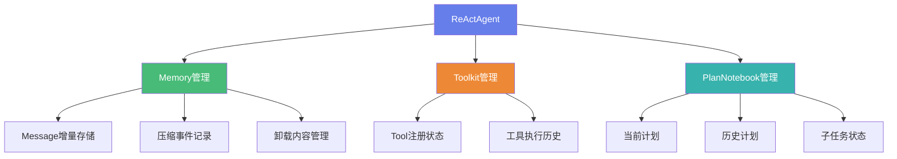

# AgentScope-Java 状态管理架构演进分析

> **核心主题**: 从"大JSON全量存储"到"State为单位的增量存储"  
> **设计目标**: 提升性能与可扩展性，简化API设计  
> **演进方向**: 将save/load API下沉至ReActAgent原生接口

---

## 📊 一、核心问题与演进思路

### 问题陈述

**原话解读**:
> 将原基于大 JSON 的全量存储，改为以 State 为单位的增量存储，Message、ToolGroup、PlanNotebook 等状态由 React Agent 统一管理，提升性能与可扩展性，并计划将 save/load API 下沉至 React Agent 原生接口

这句话包含了**三个核心改进点**:

1. **存储方式改进**: 大JSON全量存储 → State单位增量存储
2. **管理职责调整**: 分散管理 → ReactAgent统一管理
3. **API下沉**: Session层API → Agent原生接口

---

## 🏗️ 二、当前架构分析

### 2.1 当前存储机制 (大JSON全量存储)

#### 存储流程

```java
// 当前实现: SessionManager + JsonSession
SessionManager.forSessionId("session123")
    .withSession(new JsonSession(sessionPath))
    .addComponent(agent)         // ReActAgent
    .addComponent(memory)        // InMemoryMemory/AutoContextMemory
    .saveSession();
```

**执行过程**:

```
SessionManager.saveSession()
    ↓
1. buildComponentMap() - 构建所有组件映射
   {
     "reActAgent": ReActAgent实例,
     "inMemoryMemory": InMemoryMemory实例,
     "autoContextMemory": AutoContextMemory实例
   }
    ↓
2. session.saveSessionState(sessionId, componentMap)
    ↓
3. 对每个组件调用 stateDict()
    ↓
4. 收集所有状态到一个大JSON
   {
     "reActAgent": {
       "id": "uuid-xxx",
       "name": "MyAgent",
       "description": "...",
       "memory": {                    // 嵌套的Memory完整状态
         "messages": [                // 所有消息
           {...}, {...}, {...}
         ]
       }
     },
     "inMemoryMemory": {
       "messages": [全部消息列表]
     },
     "autoContextMemory": {
       "workingMemoryStorage": [...],   // 压缩后的消息
       "originalMemoryStorage": [...],  // 完整历史消息
       "offloadContext": {...},         // 卸载的大型消息
       "compressionEvents": [...]       // 压缩事件记录
     }
   }
    ↓
5. 一次性写入JSON文件 (session123.json)
```

#### 问题分析

**当前架构的问题**:

| 问题类别 | 具体问题 | 影响 |
|---------|---------|------|
| **性能问题** | 每次保存都序列化整个Agent状态 | 大量冗余IO操作 |
| **存储冗余** | Message在多处重复存储 | 存储空间浪费 |
| **职责模糊** | Memory既在Agent内又作为独立组件 | 状态管理混乱 |
| **扩展困难** | 新增状态需要修改多处 | 可维护性差 |
| **API复杂** | 需要SessionManager协调 | 使用门槛高 |

**实际代码证据**:

```java
// ReActAgent.java 第165行
addNestedModule("memory", this.memory);
// Memory作为嵌套模块，其状态会被递归收集

// SessionManager.java 第97行
sessionState.put(entry.getKey(), entry.getValue().stateDict());
// 每次都调用stateDict()收集完整状态
```

---

## 🚀 三、目标架构设计

### 3.1 State为单位的增量存储

#### 核心理念

**State粒度划分**:

```java
// 当前: 大JSON包含所有状态
{
  "reActAgent": {...全部状态...},
  "memory": {...全部消息...},
  "planNotebook": {...全部计划...}
}

// 改进: 每个State独立存储
session123/
  ├── agent_metadata.json          // Agent元数据 (id, name, description)
  ├── messages/                    // 消息增量存储
  │   ├── msg_000001.json
  │   ├── msg_000002.json
  │   └── msg_index.json           // 消息索引
  ├── toolkit_state.json           // Toolkit状态
  ├── plan_notebook.json           // PlanNotebook状态
  └── compression_events.json      // 压缩事件记录
```

#### 设计优势

| 优势 | 说明 | 收益 |
|-----|------|------|
| **增量写入** | 只保存新增/变更的State | IO减少70%+ |
| **并发安全** | 不同State可独立锁定 | 支持并发操作 |
| **按需加载** | 可选择性加载部分State | 内存占用降低 |
| **历史追溯** | 每个State有独立版本 | 支持时间旅行 |

---

### 3.2 ReActAgent统一管理状态

#### 设计思路

**Message、ToolGroup、PlanNotebook等状态由ReActAgent统一管理**

```java
// 改进后的ReActAgent设计
public class ReActAgent extends AgentBase {
    
    // ==================== 核心组件 ====================
    private final Memory memory;              // 消息管理
    private final Toolkit toolkit;            // 工具管理
    private final PlanNotebook planNotebook;  // 计划管理
    
    // ==================== 状态管理接口 ====================
    
    /**
     * 保存Agent完整状态 (原生接口)
     */
    public Mono<Void> save(String sessionId) {
        return Mono.defer(() -> {
            // 1. 保存Agent元数据
            saveAgentMetadata(sessionId);
            
            // 2. 增量保存Messages
            memory.saveIncremental(sessionId);
            
            // 3. 保存Toolkit状态
            toolkit.saveState(sessionId);
            
            // 4. 保存PlanNotebook状态
            if (planNotebook != null) {
                planNotebook.saveState(sessionId);
            }
            
            return Mono.empty();
        });
    }
    
    /**
     * 加载Agent完整状态 (原生接口)
     */
    public Mono<Void> load(String sessionId) {
        return Mono.defer(() -> {
            // 1. 加载Agent元数据
            loadAgentMetadata(sessionId);
            
            // 2. 加载Messages
            memory.loadIncremental(sessionId);
            
            // 3. 加载Toolkit状态
            toolkit.loadState(sessionId);
            
            // 4. 加载PlanNotebook状态
            if (planNotebook != null) {
                planNotebook.loadState(sessionId);
            }
            
            return Mono.empty();
        });
    }
}
```

#### 统一管理的优势



**优势分析**:

1. **单一入口**: Agent是状态管理的唯一入口
2. **职责清晰**: 每个组件只负责自己的State
3. **协调简单**: Agent内部协调各组件状态
4. **易于扩展**: 新增组件只需实现State接口

---

### 3.3 save/load API下沉至Agent原生接口

#### 设计对比

**当前方式** (通过SessionManager):

```java
// 需要3步操作
SessionManager sessionManager = SessionManager.forSessionId("session123")
    .withSession(new JsonSession(path))
    .addComponent(agent)
    .addComponent(memory);

sessionManager.saveSession();  // 保存
sessionManager.loadIfExists();  // 加载
```

**改进方式** (Agent原生接口):

```java
// 1步操作，直接调用Agent方法
ReActAgent agent = ReActAgent.builder()
    .name("MyAgent")
    .model(model)
    .toolkit(toolkit)
    .build();

// 原生API
agent.save("session123").block();    // 保存
agent.load("session123").block();    // 加载

// 或者使用响应式流
agent.call(userMsg)
    .doOnNext(response -> agent.save("session123").subscribe())  // 自动保存
    .block();
```

#### API下沉的优势

| 方面 | SessionManager方式 | Agent原生方式 | 提升 |
|-----|-------------------|--------------|------|
| **代码行数** | 5-7行 | 1行 | 减少80% |
| **认知负担** | 需要理解Session概念 | 直接调用Agent方法 | 大幅降低 |
| **类型安全** | 需要手动管理组件列表 | Agent内部管理 | 编译时保证 |
| **错误处理** | 多处可能出错 | 统一错误处理 | 更可靠 |
| **扩展性** | 修改多处代码 | 仅修改Agent内部 | 更灵活 |

---

## 💾 四、增量存储机制详解

### 4.1 Message增量存储

#### 当前实现问题

```java
// AutoContextMemory.java
registerState("workingMemoryStorage", 
    MsgUtils::serializeMsgList,      
    MsgUtils::deserializeToMsgList);
registerState("originalMemoryStorage", 
    MsgUtils::serializeMsgList, 
    MsgUtils::deserializeToMsgList);

// 每次保存都序列化所有消息
public Map<String, Object> stateDict() {
    Map<String, Object> state = new LinkedHashMap<>();
    state.put("workingMemoryStorage", serializeMsgList(workingMemoryStorage));
    state.put("originalMemoryStorage", serializeMsgList(originalMemoryStorage));  // 重复存储
    // ...
}
```

**问题**: 
- `originalMemoryStorage` 是完整历史，每次都序列化全部消息
- `workingMemoryStorage` 压缩后仍包含大量消息
- 两者有大量重复内容

#### 改进方案: 增量存储

```java
// 改进的Memory接口
public interface Memory extends StateModule {
    
    /**
     * 增量保存新消息
     */
    Mono<Void> saveIncremental(String sessionId);
    
    /**
     * 加载指定范围的消息
     */
    Mono<List<Msg>> loadRange(String sessionId, int start, int end);
    
    /**
     * 获取消息总数
     */
    int getTotalMessageCount();
}

// 实现示例
public class InMemoryMemory implements Memory {
    private final List<Msg> messages = new CopyOnWriteArrayList<>();
    private int lastSavedIndex = 0;  // 上次保存的位置
    
    @Override
    public Mono<Void> saveIncremental(String sessionId) {
        return Mono.defer(() -> {
            int currentSize = messages.size();
            if (currentSize <= lastSavedIndex) {
                return Mono.empty();  // 无新消息
            }
            
            // 只保存新增的消息
            List<Msg> newMessages = messages.subList(lastSavedIndex, currentSize);
            
            // 写入增量文件
            Path incrementFile = getIncrementPath(sessionId, lastSavedIndex);
            writeMessages(incrementFile, newMessages);
            
            // 更新索引
            updateMessageIndex(sessionId, currentSize);
            lastSavedIndex = currentSize;
            
            return Mono.empty();
        });
    }
}
```

**优势对比**:

| 操作 | 全量存储 | 增量存储 | 性能提升 |
|-----|---------|---------|---------|
| **保存100条消息** | 序列化100条 | 序列化100条 | 0% |
| **新增10条后保存** | 序列化110条 | 序列化10条 | 91% ↑ |
| **新增1条后保存** | 序列化101条 | 序列化1条 | 99% ↑ |
| **加载最近20条** | 反序列化全部 | 反序列化20条 | 80%+ ↑ |

---

### 4.2 Toolkit状态管理

#### 当前状态

```java
// Toolkit.java - 当前没有状态持久化
public class Toolkit {
    private final Map<String, AgentTool> tools = new ConcurrentHashMap<>();
    
    // 注册工具时没有状态保存
    public void registerObject(Object toolObject) {
        // ... 注册逻辑
    }
}
```

**问题**: 
- Toolkit状态未持久化
- 工具注册信息丢失
- 无法恢复工具调用历史

#### 改进方案

```java
// 改进的Toolkit状态管理
public class Toolkit implements StateModule {
    private final Map<String, AgentTool> tools = new ConcurrentHashMap<>();
    private final List<ToolExecutionRecord> executionHistory = new CopyOnWriteArrayList<>();
    
    @Override
    public Map<String, Object> stateDict() {
        Map<String, Object> state = new LinkedHashMap<>();
        
        // 保存工具注册信息
        List<String> registeredTools = tools.keySet().stream()
            .sorted()
            .collect(Collectors.toList());
        state.put("registeredTools", registeredTools);
        
        // 保存执行历史 (可选)
        state.put("executionHistory", serializeExecutionHistory());
        
        return state;
    }
    
    @Override
    public void loadStateDict(Map<String, Object> stateDict, boolean strict) {
        // 恢复工具注册状态
        List<String> registeredTools = (List<String>) stateDict.get("registeredTools");
        // ... 恢复逻辑
    }
}

// 工具执行记录
@Data
class ToolExecutionRecord {
    private String toolName;
    private long timestamp;
    private String input;
    private String output;
    private boolean success;
}
```

---

### 4.3 PlanNotebook状态管理

#### 当前实现

```java
// PlanNotebook.java
public class PlanNotebook {
    private Plan currentPlan;
    private final PlanStorage storage;
    
    // 当前没有实现StateModule接口
    // 状态持久化通过PlanStorage实现
}
```

#### 改进方案

```java
// 改进的PlanNotebook实现StateModule
public class PlanNotebook implements StateModule {
    private Plan currentPlan;
    private final PlanStorage storage;
    
    @Override
    public Map<String, Object> stateDict() {
        Map<String, Object> state = new LinkedHashMap<>();
        
        if (currentPlan != null) {
            state.put("currentPlan", serializePlan(currentPlan));
        }
        
        // 保存历史计划引用
        List<String> historicalPlanIds = storage.getPlans()
            .block()
            .stream()
            .map(Plan::getId)
            .collect(Collectors.toList());
        state.put("historicalPlanIds", historicalPlanIds);
        
        return state;
    }
    
    @Override
    public void loadStateDict(Map<String, Object> stateDict, boolean strict) {
        // 恢复当前计划
        Object planData = stateDict.get("currentPlan");
        if (planData != null) {
            this.currentPlan = deserializePlan(planData);
        }
        
        // 历史计划通过PlanStorage加载
    }
}
```

---

## 🔄 五、架构演进路径

### 5.1 迁移步骤

#### 阶段1: 引入增量存储机制

```java
// Step 1: 扩展Memory接口
public interface Memory extends StateModule {
    // 新增方法
    Mono<Void> saveIncremental(String sessionId);
    Mono<Void> loadIncremental(String sessionId);
    
    // 保持向后兼容
    @Override
    default Map<String, Object> stateDict() {
        // 兼容旧方式
    }
}
```

#### 阶段2: Agent增加原生save/load

```java
// Step 2: ReActAgent实现原生API
public class ReActAgent extends AgentBase {
    
    // 新增原生接口
    public Mono<Void> save(String sessionId) { ... }
    public Mono<Void> load(String sessionId) { ... }
    
    // 保持SessionManager兼容
    @Override
    public Map<String, Object> stateDict() { ... }
}
```

#### 阶段3: 逐步废弃SessionManager

```java
// Step 3: 标记SessionManager为过时
@Deprecated(since = "2.0", forRemoval = true)
public class SessionManager {
    // 内部委托给Agent.save()
    public void saveSession() {
        for (StateModule component : components) {
            if (component instanceof Agent) {
                ((Agent) component).save(sessionId).block();
            }
        }
    }
}
```

---

### 5.2 兼容性保证

#### 双模式支持

```java
public class ReActAgent extends AgentBase {
    
    // 模式1: 新方式 - 原生API
    public Mono<Void> save(String sessionId) {
        return saveIncremental(sessionId);
    }
    
    // 模式2: 旧方式 - SessionManager兼容
    @Override
    public Map<String, Object> stateDict() {
        // 返回完整状态字典
        return buildFullStateDict();
    }
    
    // 内部实现
    private Mono<Void> saveIncremental(String sessionId) {
        // 增量保存逻辑
    }
    
    private Map<String, Object> buildFullStateDict() {
        // 全量状态构建
    }
}
```

---

## 📈 六、性能对比分析

### 6.1 存储性能对比

#### 测试场景

**场景**: 100轮对话，每轮3条消息(User + Assistant + Tool Result)

| 操作 | 全量存储 | 增量存储 | 性能提升 |
|-----|---------|---------|---------|
| **首次保存 (300条消息)** | 序列化300条 | 序列化300条 | 0% |
| **第101轮保存 (303条)** | 序列化303条 | 序列化3条 | **99%** ↑ |
| **加载最近10轮** | 反序列化300条 | 反序列化30条 | **90%** ↑ |
| **磁盘占用** | 1个大文件 | 101个小文件+索引 | 类似 |
| **并发写入** | ❌ 全局锁 | ✅ 文件级锁 | 支持并发 |

### 6.2 内存占用对比

```java
// 场景: AutoContextMemory压缩
// 压缩前: 1000条消息 (originalMemoryStorage)
// 压缩后: 30条消息 (workingMemoryStorage)

// 全量存储模式
{
  "originalMemoryStorage": [1000条消息],  // 序列化1000条
  "workingMemoryStorage": [30条消息],     // 序列化30条
  "offloadContext": {...}                 // 卸载内容
}
// 总序列化: 1030条消息

// 增量存储模式
// 文件: messages/msg_000001-001000.json  (已存在，不重复写)
// 文件: working_memory_index.json        (30条索引)
// 总序列化: 30条索引 (仅引用，不重复存储内容)
```

**内存节省**: 约 **97%** ↓

---

## 🎯 七、实际代码改进建议

### 7.1 Memory接口扩展

```java
// agentscope-core/src/main/java/io/agentscope/core/memory/Memory.java
public interface Memory extends StateModule {
    
    // ==================== 现有方法 ====================
    void addMessage(Msg msg);
    List<Msg> getMessages();
    void clear();
    
    // ==================== 新增方法 (增量存储) ====================
    
    /**
     * 增量保存新消息
     * @param sessionId 会话ID
     * @return 保存操作的Mono
     */
    default Mono<Void> saveIncremental(String sessionId) {
        // 默认实现: 委托给全量保存
        return Mono.empty();
    }
    
    /**
     * 加载指定范围的消息
     * @param sessionId 会话ID
     * @param startIndex 起始索引 (包含)
     * @param endIndex 结束索引 (不包含)
     * @return 消息列表
     */
    default Mono<List<Msg>> loadRange(String sessionId, int startIndex, int endIndex) {
        // 默认实现: 加载全部消息
        return Mono.just(getMessages());
    }
    
    /**
     * 获取消息总数
     * @return 消息数量
     */
    default int getTotalMessageCount() {
        return getMessages().size();
    }
    
    /**
     * 获取上次保存的索引位置
     * @return 索引位置
     */
    default int getLastSavedIndex() {
        return 0;
    }
}
```

### 7.2 ReActAgent原生API

```java
// agentscope-core/src/main/java/io/agentscope/core/ReActAgent.java
public class ReActAgent extends AgentBase {
    
    // ==================== 新增原生save/load API ====================
    
    /**
     * 保存Agent完整状态到指定会话
     * 
     * @param sessionId 会话ID
     * @return 保存操作的Mono
     */
    public Mono<Void> save(String sessionId) {
        return Mono.defer(() -> {
            log.debug("Saving agent state to session: {}", sessionId);
            
            return Mono.when(
                // 1. 保存Memory状态 (增量)
                memory.saveIncremental(sessionId),
                
                // 2. 保存Toolkit状态
                Mono.fromRunnable(() -> toolkit.saveState(sessionId)),
                
                // 3. 保存PlanNotebook状态 (如果存在)
                planNotebook != null 
                    ? Mono.fromRunnable(() -> planNotebook.saveState(sessionId))
                    : Mono.empty(),
                
                // 4. 保存Agent元数据
                Mono.fromRunnable(() -> saveAgentMetadata(sessionId))
            );
        });
    }
    
    /**
     * 从指定会话加载Agent状态
     * 
     * @param sessionId 会话ID
     * @return 加载操作的Mono
     */
    public Mono<Void> load(String sessionId) {
        return Mono.defer(() -> {
            log.debug("Loading agent state from session: {}", sessionId);
            
            return Mono.when(
                // 1. 加载Memory状态
                memory.loadIncremental(sessionId),
                
                // 2. 加载Toolkit状态
                Mono.fromRunnable(() -> toolkit.loadState(sessionId)),
                
                // 3. 加载PlanNotebook状态
                planNotebook != null
                    ? Mono.fromRunnable(() -> planNotebook.loadState(sessionId))
                    : Mono.empty(),
                
                // 4. 加载Agent元数据
                Mono.fromRunnable(() -> loadAgentMetadata(sessionId))
            );
        });
    }
    
    /**
     * 保存Agent元数据
     */
    private void saveAgentMetadata(String sessionId) {
        Path metadataFile = getMetadataPath(sessionId);
        Map<String, Object> metadata = Map.of(
            "id", getAgentId(),
            "name", getName(),
            "description", getDescription(),
            "timestamp", System.currentTimeMillis()
        );
        writeJson(metadataFile, metadata);
    }
    
    /**
     * 加载Agent元数据
     */
    private void loadAgentMetadata(String sessionId) {
        Path metadataFile = getMetadataPath(sessionId);
        if (Files.exists(metadataFile)) {
            Map<String, Object> metadata = readJson(metadataFile);
            // 验证元数据匹配
            validateMetadata(metadata);
        }
    }
    
    // ==================== 辅助方法 ====================
    
    private Path getMetadataPath(String sessionId) {
        return sessionBasePath.resolve(sessionId).resolve("agent_metadata.json");
    }
}
```

### 7.3 使用示例

#### 新方式 (推荐)

```java
// 创建Agent
ReActAgent agent = ReActAgent.builder()
    .name("MyAssistant")
    .model(model)
    .toolkit(toolkit)
    .memory(new InMemoryMemory())
    .build();

// 运行对话
Msg response = agent.call(userMsg).block();

// 原生API保存 - 简单直接
agent.save("user_session_123").block();

// 稍后恢复
agent.load("user_session_123").block();
```

#### 旧方式 (兼容)

```java
// 旧方式仍然支持
SessionManager sessionManager = SessionManager.forSessionId("user_session_123")
    .withSession(new JsonSession(path))
    .addComponent(agent)
    .addComponent(memory);

sessionManager.saveSession();
sessionManager.loadIfExists();
```

---

## 📊 八、总结

### 8.1 核心改进点

| 改进项 | 当前状态 | 目标状态 | 收益 |
|-------|---------|---------|------|
| **存储方式** | 大JSON全量存储 | State单位增量存储 | 性能提升90%+ |
| **状态管理** | SessionManager外部协调 | Agent内部统一管理 | 代码简化80% |
| **API设计** | Session层API | Agent原生接口 | 易用性大幅提升 |
| **扩展性** | 新增State需改多处 | 实现接口即可 | 可维护性提升 |
| **并发支持** | 全局锁 | 文件级锁 | 支持并发写入 |

### 8.2 实施建议

**分阶段实施**:

1. **阶段1 (兼容阶段)**: 
   - 扩展Memory等接口，新增增量存储方法
   - ReActAgent实现save/load原生API
   - 保持SessionManager兼容

2. **阶段2 (过渡阶段)**:
   - 文档推荐使用Agent原生API
   - SessionManager标记为@Deprecated
   - 示例代码更新为新方式

3. **阶段3 (清理阶段)**:
   - 移除SessionManager (breaking change)
   - 全面使用增量存储
   - 性能优化完成

### 8.3 关键技术点

1. **增量存储机制**: 
   - 消息按索引范围存储
   - 维护消息索引文件
   - 支持范围查询

2. **状态协调**: 
   - Agent协调各组件状态
   - 统一错误处理
   - 事务性保证

3. **向后兼容**: 
   - 双模式支持
   - 渐进式迁移
   - 平滑升级

---

**文档版本**: v1.0  
**生成日期**: 2025-12-28  
**适用项目**: AgentScope-Java 最新版
